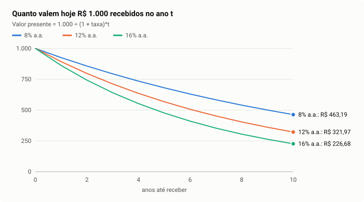

# 1. Dinheiro no tempo

> **Para que serve este capítulo.** Tudo o que o Equisim calcula é uma conta de
> uma pergunta só: *quanto vale hoje um dinheiro que só vai chegar no futuro?*
> Este capítulo ensina essa conta do zero. Sem ele, nenhum outro faz sentido.
>
> Tempo de leitura: 40 minutos. Não precisa de nada antes.

---

## 1.1 Por que R$ 100 hoje valem mais que R$ 100 daqui a um ano

Imagine duas ofertas:

- **A:** receber R$ 100 hoje.
- **B:** receber R$ 100 daqui a um ano.

Todo mundo escolhe A. O motivo não é desconfiança: com os R$ 100 na mão hoje,
dá para aplicar no CDI e ter mais de R$ 100 daqui a um ano. Em setembro de 2026
o CDI rendia cerca de 14% ao ano, então os R$ 100 de hoje viram R$ 114.

Essa é a ideia mais importante de finanças:

> **Dinheiro tem um custo de espera.** Quem espera abre mão do que o dinheiro
> renderia no melhor uso alternativo. Esse rendimento perdido se chama
> **custo de oportunidade**.

No Brasil, o custo de oportunidade mais simples é a **taxa livre de risco**:
quanto rende um investimento que quase certamente paga — um título do
Tesouro, ou o CDI. Ela aparece em todas as contas do motor.

---

## 1.2 Juros compostos: o dinheiro indo para o futuro

Se R$ 100 rendem 14% ao ano:

| Ano | Conta | Saldo |
|---:|---|---:|
| 0 | — | R$ 100,00 |
| 1 | 100 × 1,14 | R$ 114,00 |
| 2 | 114 × 1,14 | R$ 129,96 |
| 3 | 129,96 × 1,14 | R$ 148,15 |

Repare que no segundo ano o juro incide sobre os R$ 114, e não só sobre os R$ 100
iniciais. É o **juro sobre juro** — juro composto. A fórmula geral:

```
Valor futuro = Valor presente × (1 + i)^n
```

- `i` é a taxa por período (14% = 0,14);
- `n` é o número de períodos (anos).

---

## 1.3 Valor presente: o dinheiro voltando para hoje

Agora a pergunta ao contrário, que é a pergunta do Equisim: **se alguém promete
me pagar R$ 114 daqui a um ano, quanto isso vale hoje?**

Basta desfazer a conta:

```
Valor presente = Valor futuro ÷ (1 + i)^n
```

R$ 114 ÷ 1,14 = **R$ 100**. Quem paga R$ 100 hoje por essa promessa ganha
exatamente o CDI — nem mais, nem menos.

Chamamos essa operação de **descontar**, e a taxa `i` de **taxa de desconto**.
Quanto maior a taxa, menos vale hoje o dinheiro futuro:

| R$ 1.000 daqui a 10 anos, descontados a… | Valor hoje |
|---|---:|
| 8% ao ano | R$ 463,19 |
| 12% ao ano | R$ 321,97 |
| 16% ao ano | R$ 226,68 |



Duas lições para guardar:

1. **Dinheiro distante vale pouco hoje.** A 16%, mil reais daqui a dez anos
   valem menos de um quarto disso.
2. **A taxa de desconto manda muito no resultado.** Uma diferença de 4 pontos
   na taxa muda o valor hoje em 30% ou mais. É por isso que o Equisim gasta
   tanto esforço para escolher a taxa certa (capítulo 3).

---

## 1.4 Taxa ao ano, ao mês, ao dia

Juros compostos não se dividem com uma divisão simples. Se o CDI rende 14% ao
ano, ele **não** rende 14 ÷ 12 = 1,1667% ao mês. Rende:

```
taxa mensal = (1 + 0,14)^(1/12) − 1 = 1,098% ao mês
```

Conferindo: 1,01098 elevado a 12 dá 1,14. A divisão simples daria 14,93% ao ano
— erro de quase um ponto.

No Brasil, a Selic e o CDI são publicados **em base de 252 dias úteis** (os dias
em que o mercado funciona num ano). A taxa de um dia útil é:

```
taxa diária = (1 + taxa anual)^(1/252) − 1
```

**Onde isso aparece no Equisim:** o CDI corrente é o rendimento dos últimos 63
pregões convertido para ano por composição; o prazo dos títulos do Tesouro é
contado em dias úteis ÷ 252
([yield_curve.dart](../../packages/equisim_core/lib/src/services/valuation/yield_curve.dart)).
O projeto proíbe a divisão simples (regra do [CLAUDE.md](../../CLAUDE.md)).

---

## 1.5 Quando a taxa muda de um ano para o outro

Na vida real a taxa não fica parada. O mercado espera, por exemplo, que os juros
caiam nos próximos anos. Aí cada ano tem a sua taxa, e o desconto **acumula** as
taxas, uma por uma:

```
Fator de desconto do ano t = (1 + r₁) × (1 + r₂) × … × (1 + rₜ)
Valor presente do ano t   = Fluxo do ano t ÷ Fator do ano t
```

Exemplo com três anos, taxas de 14%, 13% e 12%:

| Ano | Taxa do ano | Fator acumulado | R$ 100 desse ano valem hoje |
|---:|---:|---:|---:|
| 1 | 14% | 1,14 | R$ 87,72 |
| 2 | 13% | 1,14 × 1,13 = 1,2882 | R$ 77,63 |
| 3 | 12% | 1,2882 × 1,12 = 1,4428 | R$ 69,31 |

Note que o ano 3 **não** é descontado a 12% elevado ao cubo: ele atravessa os
três anos, e cada um cobra a sua taxa.

**Onde isso aparece no Equisim:** é exatamente assim que o motor desconta os dez
anos de projeção
([dcf.dart, `_project`](../../packages/equisim_core/lib/src/services/valuation/dcf.dart)).
A taxa de cada ano vem da curva de juros do Tesouro (capítulo 3, seção 3.6).

---

## 1.6 Inflação e taxa real

Se uma aplicação rende 10% num ano em que os preços subiram 5%, o seu poder de
compra **não** cresceu 10 − 5 = 5%. Cresceu:

```
taxa real = (1 + nominal) ÷ (1 + inflação) − 1
          = 1,10 ÷ 1,05 − 1 = 4,76%
```

Essa é a **equação de Fisher**. A subtração simples erra pouco com inflação
baixa, mas no Brasil o erro chega a meio ponto.

- **Nominal** é o número que aparece no extrato.
- **Real** é o ganho de poder de compra.

**Onde isso aparece no Equisim:** o teto do crescimento perpétuo de uma empresa é
o crescimento **nominal** da economia, montado por Fisher ao contrário:
`(1 + crescimento real) × (1 + inflação) − 1`. Na data dos casos deste guia
(14/09/2026), a inflação média de dez anos (IPCA) era 4,92% ao ano e o
crescimento real médio da economia (IBC-Br) 1,77%; o teto saiu
`1,0177 × 1,0492 − 1 = 6,78%` ao ano
([portfolio_usecases.dart](../../packages/equisim_core/lib/src/usecases/portfolio_usecases.dart)).

---

## 1.7 Perpetuidade: dinheiro que nunca para de chegar

Uma empresa não tem data para acabar. Como calcular o valor de um fluxo que
chega todo ano, para sempre?

**Sem crescimento.** Se chegam R$ 10 por ano, para sempre, e a taxa é 12%:

```
Valor = Fluxo ÷ taxa = 10 ÷ 0,12 = R$ 83,33
```

Parece mágica somar infinitos anos e dar um número finito, mas os anos distantes
valem quase nada hoje (seção 1.3), e a soma converge. Faz sentido: quem aplica
R$ 83,33 a 12% recebe R$ 10 por ano de juro para sempre, sem tocar no principal.

**Com crescimento.** Se o fluxo começa em R$ 10 e cresce 5% ao ano para sempre:

```
Valor = Fluxo do próximo ano ÷ (taxa − crescimento)
      = 10 ÷ (0,12 − 0,05) = R$ 142,86
```

Essa é a **fórmula de Gordon** (Myron Gordon, 1959). Ela é o coração do "valor
terminal" do capítulo 4.

**O cuidado que ela exige.** O denominador é uma diferença. Quando taxa e
crescimento ficam próximos, o resultado explode:

| Taxa − crescimento | Valor de R$ 10 por ano |
|---:|---:|
| 7 pontos | R$ 142,86 |
| 4 pontos | R$ 250,00 |
| 2 pontos | R$ 500,00 |
| 0,5 ponto | R$ 2.000,00 |

Por isso o Equisim tem duas travas:

- o crescimento perpétuo nunca passa do crescimento nominal da economia (uma
  empresa que crescesse mais que o país para sempre acabaria maior que o país);
- a taxa precisa superar o crescimento por pelo menos meio ponto, senão a conta
  é recusada
  ([dcf.dart, `minimumSpread`](../../packages/equisim_core/lib/src/services/valuation/dcf.dart)).

---

## 1.8 O dinheiro chega ao longo do ano, e não no dia 31 de dezembro

Uma empresa não recebe o lucro do ano inteiro no último dia do ano. O caixa
entra aos poucos. Na média, é como se chegasse no meio do ano.

Descontar o fluxo inteiro como se chegasse no fim do ano cobra seis meses de
espera a mais. A correção padrão é multiplicar cada valor presente por:

```
fator de meio de ano = √(1 + taxa do ano)
```

Com taxa de 13%, √1,13 = 1,063: o valor sobe 6,3%. Parece detalhe, mas incide
sobre a avaliação inteira.

**Onde isso aparece no Equisim:** decisão 48, em
[dcf.dart, `midYearLift`](../../packages/equisim_core/lib/src/services/valuation/dcf.dart).

---

## 1.9 Juntando tudo: o valor de qualquer coisa que gera dinheiro

Se um ativo vai entregar os fluxos F₁, F₂, F₃… nos anos 1, 2, 3…, o valor dele
hoje é a soma dos valores presentes:

```
Valor = F₁ ÷ Fator₁ + F₂ ÷ Fator₂ + … + Fₙ ÷ Fatorₙ + (Valor terminal ÷ Fatorₙ)
```

- a parte da soma cobre os anos que conseguimos projetar um a um (no Equisim,
  dez);
- o **valor terminal** resume, com a fórmula de Gordon, todos os anos depois do
  décimo.

Essa soma se chama **fluxo de caixa descontado**, ou **DCF** (do inglês
*discounted cash flow*). O capítulo 4 mostra como o Equisim estima cada `F` e o
capítulo 3 mostra de onde vem cada taxa.

---

## Resumo do capítulo

| Ideia | Fórmula | Guarde isto |
|---|---|---|
| Valor futuro | `VP × (1+i)^n` | juro sobre juro |
| Valor presente | `VF ÷ (1+i)^n` | descontar é trazer o futuro para hoje |
| Taxa por período | `(1+i)^(1/n) − 1` | nunca dividir a taxa |
| Taxas diferentes por ano | multiplicar `(1+rₜ)` ano a ano | o fator acumula |
| Taxa real | `(1+nominal)/(1+inflação) − 1` | Fisher, não subtração |
| Perpetuidade | `F ÷ r` | fluxo eterno sem crescimento |
| Gordon | `F₁ ÷ (r − g)` | explode quando `g` chega perto de `r` |
| Meio de ano | `× √(1+r)` | o caixa chega ao longo do ano |

## Para estudar mais

- **Assaf Neto, *Matemática Financeira e Suas Aplicações*** (Atlas) — capítulos
  de juros compostos e taxas equivalentes. Em português, com a base 252.
- **Aswath Damodaran, *Valuation: como avaliar empresas e escolher as melhores
  ações*** (LTC) — capítulo sobre valor do dinheiro no tempo.
- **Khan Academy**, trilha "Juros e dívida" (gratuita, em português).
- **Damodaran Online** (pages.stern.nyu.edu/~adamodar), aulas gratuitas de
  *Valuation*, sessão 2 ("The time value of money") — em inglês, com legenda.
