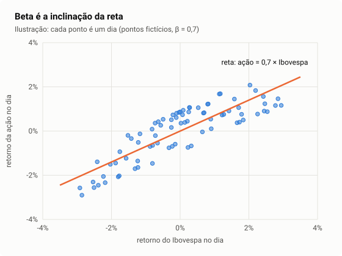
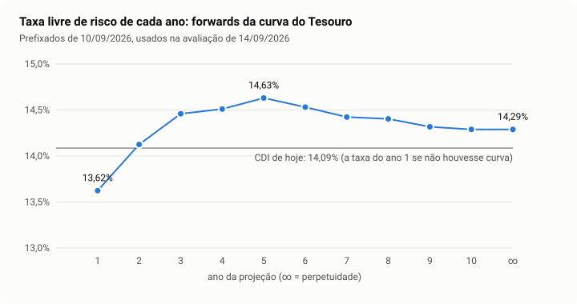

# 3. Risco e retorno: de onde vem a taxa de desconto

> **Para que serve este capítulo.** O capítulo 1 mostrou que a taxa de desconto
> manda no resultado. Este mostra como o Equisim escolhe essa taxa para cada
> empresa: quanto um investidor exige para carregar o risco daquela ação, e
> quanto a empresa paga pela dívida.
>
> Tempo de leitura: 1 hora e meia. Pré-requisitos: capítulos 1 e 2.
> Termos estatísticos (média, desvio-padrão, regressão) estão explicados no
> capítulo 6 — pode consultá-lo quando aparecerem.

---

## 3.1 Retorno e volatilidade de uma ação

O **retorno** de uma ação num período é quanto o dinheiro de quem a segurou
cresceu: a variação do preço mais os proventos (dividendos, juros sobre capital)
recebidos.

```
retorno do dia = (preço de hoje + provento pago hoje) ÷ preço de ontem − 1
```

Ações não sobem em linha reta. A **volatilidade** mede o tamanho típico das
oscilações: é o desvio-padrão dos retornos diários, convertido para ano
multiplicando por √252 (os dias úteis do ano).

```
volatilidade anual = desvio-padrão dos retornos diários × √252
```

Uma ação com volatilidade de 30% ao ano costuma oscilar, num ano típico, algo
como 30% para cima ou para baixo em torno do que se esperava.

**No Equisim**, a volatilidade dos últimos 252 pregões alimenta a **faixa
calibrada** da tela de avaliação (capítulo 4, seção 4.10)
([calibrated_band.dart](../../packages/equisim_core/lib/src/services/valuation/calibrated_band.dart)).

---

## 3.2 Nem todo risco é pago

Parte da oscilação de uma ação é **dela**: um acidente na fábrica, um contrato
perdido, uma troca de diretoria. Outra parte é **do mercado todo**: juros
subindo, recessão, crise política.

O risco que é só da empresa desaparece quando se tem uma carteira com muitas
empresas — os azares de umas compensam as sortes de outras. Isso se chama
**diversificação**. Já o risco do mercado todo não some: quando a economia
inteira vai mal, quase todas caem juntas.

> **A ideia central da teoria de finanças (Sharpe, 1964):** o mercado só paga
> prêmio pelo risco que não dá para eliminar diversificando. O risco que se
> elimina de graça não merece recompensa.

Então a pergunta certa não é "quanto esta ação oscila?", e sim "quanto ela
oscila **junto com o mercado**?". A resposta é o **beta**.

---

## 3.3 Beta: quanto a ação acompanha o mercado

O **beta** (β) mede quanto a ação costuma se mover quando o mercado (o
Ibovespa) se move 1%:

| Beta | Leitura | Exemplo de comportamento |
|---:|---|---|
| 1,0 | anda junto com o mercado | Ibovespa cai 10%, a ação cai ~10% |
| 0,5 | defensiva | Ibovespa cai 10%, a ação cai ~5% |
| 1,5 | agressiva | Ibovespa cai 10%, a ação cai ~15% |

**Como o Equisim mede.** Pega cinco anos de retornos diários da ação e do
Ibovespa, pareados por data, e traça a reta que melhor passa pelos pontos
(regressão linear; capítulo 6, seção 6.4). A inclinação dessa reta é o beta:

```
β = covariância(retorno da ação, retorno do Ibovespa) ÷ variância(retorno do Ibovespa)
```



Detalhes que o motor cuida:

- **Retorno total dos dois lados.** O Ibovespa já inclui os proventos
  reinvestidos. Se a ação entrasse só pelo preço, o dia em que ela paga
  dividendo (e o preço cai por isso) pareceria uma queda de risco. O motor monta
  o retorno da ação com os proventos da B3 (decisão 89).
- **Pelo menos 30 dias pareados**; com menos, o beta é fixado em 1 e isso fica
  registrado.
- **Janela curta é declarada.** Empresa listada há menos de quatro anos gera
  aviso (decisão 111).

**No código:** [beta.dart](../../packages/equisim_core/lib/src/services/metrics/beta.dart)
e [prepare_valuation_inputs.dart, `_estimateBeta`](../../packages/equisim_core/lib/src/usecases/prepare_valuation_inputs.dart).

---

## 3.4 Um beta medido tem erro — e o motor o corrige

Cinco anos de dados diários parecem muito, mas o beta estimado ainda tem
**erro-padrão**: se a história tivesse sido um pouco diferente, a reta sairia
com outra inclinação. Para ações que negociam pouco, ou que oscilam muito por
motivos próprios, o erro é grande.

A solução do motor é o **encolhimento** (em inglês, *shrinkage*): puxar o beta
medido na direção do beta típico do setor da empresa, **mais ou menos** conforme
a precisão da medida.

```
peso da medida = (1 ÷ erro²) ÷ (1 ÷ erro² + 1 ÷ dispersão²)
β final = peso × β medido + (1 − peso) × β do setor
```

- Se o erro da medida é pequeno, o peso fica perto de 1 e vale a medida.
- Se o erro é grande, o peso cai e o beta do setor ganha força.
- A "dispersão" é o quanto os betas das empresas brasileiras variam entre si
  (0,53, medido em 10/09/2026).

Na prática o peso mediano é 0,98: quase sempre vale a própria medida. O
encolhimento só age onde ela é ruim. Essa é a mesma lógica do "beta de Vasicek"
(1973) e dos ajustes que a Bloomberg aplica.

**No código:** [beta_shrinkage.dart](../../packages/equisim_core/lib/src/services/metrics/beta_shrinkage.dart)
(decisão 40).

---

## 3.5 Dívida aumenta o risco do sócio (Hamada)

Duas empresas idênticas, uma sem dívida e outra com muita. Quando as vendas
caem 10%, a endividada continua devendo os mesmos juros: o lucro do sócio cai
**mais** que 10%. A dívida amplifica o risco do acionista, e portanto o beta.

A fórmula de **Hamada** (1972) separa as duas coisas:

```
β alavancado = β desalavancado × (1 + (1 − imposto) × Dívida ÷ Patrimônio)
```

- **β desalavancado** (β_U): o risco do negócio em si, como se não houvesse
  dívida.
- **β alavancado** (β_L): o risco que o sócio carrega, com a dívida que existe.

O motor usa Hamada em dois lugares:

1. para comparar o beta de uma empresa com o do setor, as duas desalavancadas;
2. para recalcular, ano a ano da projeção, o risco do sócio conforme a dívida
   muda (seção 3.10).

O motor limita Dívida ÷ Patrimônio a 3 nessa conta: acima disso a fórmula
perde sentido (limitação declarada em
[limitações](../validacao/limitacoes.md)).

---

## 3.6 A taxa livre de risco: Selic, CDI e a curva do Tesouro

A **taxa livre de risco** é quanto rende um investimento que quase certamente
paga. No Brasil há três candidatas:

- **Selic**: a taxa básica que o Banco Central define.
- **CDI**: a taxa dos empréstimos de um dia entre bancos, que anda colada à
  Selic. Em setembro de 2026, cerca de 14,1% ao ano.
- **Títulos prefixados do Tesouro** (Tesouro Prefixado e Prefixado com Juros
  Semestrais): pagam uma taxa combinada hoje para prazos de alguns meses até
  dez anos.

O CDI tem um problema para avaliar empresas: é a taxa de **um dia**. Uma empresa
gera caixa por décadas. Usar a taxa de hoje para os próximos trinta anos supõe
que os juros de hoje ficam para sempre — no topo de um ciclo de alta, isso
esmaga o valor; no fundo, infla.

**A curva de juros.** Os títulos prefixados de vários prazos formam uma curva:
para cada prazo, a taxa que o mercado aceita hoje. Dela se tira a taxa que o
mercado espera para **cada ano futuro**, chamada **taxa a termo** (*forward*):

```
(1 + taxa à vista de 2 anos)² = (1 + taxa à vista de 1 ano) × (1 + forward do ano 2)
```

Exemplo: se o título de 1 ano paga 13,6% e o de 2 anos paga 13,9% ao ano, o
mercado está embutindo uma taxa de 1,139² ÷ 1,136 − 1 ≈ 14,2% para o segundo
ano.

Na data dos casos deste guia (14/09/2026), os forwards anuais eram:

| Ano | 1 | 2 | 3 | 4 | 5 | 6 | 7 | 8 | 9 | 10 | depois do 10 |
|---|---|---|---|---|---|---|---|---|---|---|---|
| Taxa | 13,62% | 14,13% | 14,46% | 14,51% | 14,63% | 14,53% | 14,42% | 14,40% | 14,32% | 14,29% | 14,29% |



**O Equisim usa um forward para cada ano da projeção** e o forward depois do
décimo ano para a perpetuidade (decisão 74). Sem a curva (o pacote do
aplicativo web vence em sete dias), o motor recua para duas pontas: o CDI de
hoje no ano 1 e a média de dez anos do CDI na perpetuidade, ligadas por uma
reta.

**No código:** [yield_curve.dart](../../packages/equisim_core/lib/src/services/valuation/yield_curve.dart).

---

## 3.7 O prêmio de risco de mercado

Quanto um investidor exige, a mais que a taxa livre de risco, para ficar no
mercado de ações em vez da renda fixa? Esse adicional é o **prêmio de risco de
mercado**. É uma das premissas mais discutidas de finanças, e o Equisim o tira
do próprio preço da bolsa (decisão 142).

**A ideia, com um título de renda fixa.** Se um título paga R$ 100 por ano para
sempre e custa R$ 1.000, quem o compra está aceitando ganhar 10% ao ano: a taxa
está escondida no preço. Com a bolsa é igual. O valor de mercado de todas as
companhias juntas é o preço; os dividendos e juros sobre capital próprio que
elas pagam são o "cupom", que cresce com a economia. Dá para descobrir a taxa
que o preço embute — o **retorno implícito** — com a fórmula de Gordon:

```
retorno implícito = rendimento × (1 + crescimento) + crescimento
```

Em 14/09/2026: as listadas pagaram 6,05% do valor delas nos doze meses
anteriores, e a economia cresce 6,78% ao ano em termos nominais; o retorno que o
preço embute é 6,05% × 1,0678 + 6,78% = **13,24%**. O título prefixado de dez
anos do Tesouro pagava 14,38%. O **prêmio implícito** daquele dia é a
diferença: 13,24% − 14,38% = **−1,14%**. O mercado estava pagando menos na bolsa
que no Tesouro.

**Por que a média de dez anos.** O prêmio de um trimestre pula: fica negativo
quando os juros do Tesouro disparam, como em 2015, em 2024 e em 2026. Prêmio
negativo não faz sentido no CAPM — diria que a ação mais arriscada exige
*menos* retorno. Por isso o motor usa a **média dos últimos dez anos** de
trimestres: **1,21%** em 14/09/2026. Essa média ficou positiva, entre 0,9% e 1,6%,
em todas as datas testadas desde 2018, e bate com o que o Ibovespa rendeu acima
do CDI em dez anos (+1,85%) — dois caminhos independentes dando a mesma ordem
de grandeza ([premio_implicito.md](../validacao/premio_implicito.md)).

**Antes era 5,5%.** Até 01/10/2026 o prêmio era um parâmetro fixo, o meio da
faixa de 5% a 6% que os livros costumam usar
([decisão 116](../decisoes/116-o-premio-de-mercado-fica-em-5-5-por-cento-por-medicao-das-duas-alternativas.md)).
O orientador perguntou se dava para capturá-lo do mercado em vez de fixá-lo;
medido, o mercado brasileiro paga muito menos que 5,5% acima do prefixado — o
título do Tesouro já rende tanto que sobra pouco prêmio para a bolsa. Os 5,5%
continuam no código só como recuo, se a série do prêmio implícito não chegar ao
aplicativo.

**O que o número carrega:** supõe que os dividendos crescem com a economia (um
ponto a mais de crescimento sobe o prêmio em cerca de um ponto), não conta a
recompra de ações e soma só as companhias listadas hoje. E é bem menor que o
prêmio que Damodaran publica para o Brasil, porque o dele é medido em dólar
contra o título americano; o do Equisim é contra o prefixado brasileiro, que já
carrega o risco do país. Ver as [limitações](../validacao/limitacoes.md).

**No código:** [implied_premium.dart](../../packages/equisim_core/lib/src/services/valuation/implied_premium.dart)
(a média) e [tool/premio_implicito.dart](../../tool/premio_implicito.dart) (a
série, medida trimestre a trimestre).

---

## 3.8 CAPM: o retorno que o sócio exige

O **CAPM** (*Capital Asset Pricing Model*; Sharpe, 1964; Lintner, 1965) junta as
três peças:

```
Ke = taxa livre de risco + β × prêmio de mercado
```

`Ke` é o **custo do capital próprio**: o retorno anual que o sócio exige para
ficar com aquela ação.

Exemplo, com os números da WEG em 14/09/2026:

```
Ke = 14,09% + 0,714 × 1,21% = 14,09% + 0,86% = 14,95%
```

Quem compra WEG exige, em média, 15% ao ano. Uma empresa com β = 1,3 exigiria
14,09% + 1,57% = 15,66%. Com um prêmio pequeno, o beta muda pouco o Ke: quase
todo ele é a taxa do Tesouro.

**Dois usos do mesmo Ke:**

- **na avaliação**, cada ano da projeção usa o forward daquele ano no lugar do
  CDI (seção 3.6), e o risco do sócio recalculado com a dívida daquele ano
  (seção 3.10);
- **na tela de metas**, o retorno esperado de cada ação é o Ke calculado com o
  CDI de hoje (decisão 103).

---

## 3.9 O custo da dívida e o escudo fiscal

A empresa também se financia com dívida. O custo da dívida (`Kd`) é a taxa livre
de risco mais um **prêmio de crédito** (*spread*) que depende de quão arriscado
é emprestar para ela.

O motor não usa "despesa financeira ÷ dívida" diretamente, porque essa conta
mistura arrendamentos, variação cambial e dívidas antigas a taxas velhas
(decisão 31). Em vez disso, classifica a empresa por duas réguas, no estilo das
agências de rating:

| Dívida líquida ÷ EBITDA | Prêmio | | Cobertura (EBIT ÷ juros) | Prêmio |
|---|---:|---|---|---:|
| caixa líquido | 1,0% | | 8,5 ou mais | 1,0% |
| até 1 | 1,3% | | 6,5 a 8,5 | 1,3% |
| até 2 | 1,8% | | 5,5 a 6,5 | 1,6% |
| até 2,5 | 2,4% | | 4,25 a 5,5 | 2,0% |
| até 3 | 3,1% | | 3 a 4,25 | 2,4% |
| até 3,5 | 4,0% | | 2,5 a 3 | 3,1% |
| até 4 | 5,5% | | 2 a 2,5 | 4,0% |
| até 5 | 7,5% | | 1,5 a 2 | 5,5% |
| acima de 5, ou EBITDA negativo | 10,0% | | 1,25 a 1,5 | 7,5% |
| | | | 0,8 a 1,25 | 9,0% |
| | | | abaixo de 0,8 | 10,0% |

A alavancagem vale sempre. A cobertura só entra quando a despesa financeira
parece juro de verdade (entre a taxa livre de risco e ela mais 10 pontos), e aí
vale o **maior** dos dois prêmios (decisão 130)
([cost_of_capital.dart, `syntheticSpread`](../../packages/equisim_core/lib/src/services/valuation/cost_of_capital.dart)).

**O escudo fiscal.** Juro é despesa dedutível: cada R$ 100 de juros reduz o
imposto em R$ 34. Por isso o custo efetivo da dívida é `Kd × (1 − 34%)`. Se o
lucro operacional não cobre os juros, não há imposto a abater, e o motor reduz o
escudo na proporção da cobertura.

---

## 3.10 WACC: o custo médio do dinheiro da empresa

O **WACC** (*weighted average cost of capital*) é a média dos dois custos,
ponderada pelo tamanho de cada fonte de financiamento:

```
WACC = (E ÷ V) × Ke + (D ÷ V) × Kd × (1 − 34%)
```

- `E` é o valor de mercado das ações; `D`, a dívida líquida; `V = E + D`.

Exemplo redondo: E = 800, D = 200, Ke = 18%, Kd = 16%:

```
WACC = 0,8 × 18% + 0,2 × 16% × 0,66 = 14,4% + 2,11% = 16,51%
```

**Um refinamento do motor: o caixa rende a taxa livre de risco.** A dívida
líquida é "dívida menos caixa", mas a dívida custa `Kd` e o caixa rende só a taxa
livre de risco. O motor separa as duas pernas (decisão 113):

```
WACC = (E÷V) × Ke + (D_bruta÷V) × Kd × (1−34%) − (Caixa÷V) × Rf × (1−34%)
```

Uma empresa com mais caixa que dívida (a WEG) tem peso de dívida negativo, e o
WACC sai **acima** do Ke — o caixa rende menos que o custo do sócio.

**O WACC nunca fica abaixo da taxa livre de risco**; se a conta der menos, o
motor usa a taxa livre de risco e avisa.

### O WACC que muda ano a ano (ponto fixo)

Há uma circularidade: o peso `E ÷ V` usa o valor das ações, e o valor das ações
é justamente o que se quer calcular. Além disso, conforme a empresa cresce, a
dívida muda, e com ela o beta do sócio (Hamada).

O motor resolve isso por **ponto fixo** (decisões 41 e 105): chuta um caminho de
taxas, avalia, recalcula a dívida e o beta de cada ano com o valor obtido,
recalcula as taxas, e repete até que nada mude (tolerância de 10⁻¹⁰, no máximo
100 voltas). Começa de dois pontos diferentes, para garantir que a resposta não
depende do chute (decisão 110). Bancos não passam por isso: neles a
dívida é matéria-prima, e o beta medido já carrega a alavancagem de sempre
(capítulo 5).

**No código:** [levered_rates.dart](../../packages/equisim_core/lib/src/services/valuation/levered_rates.dart).

---

## Resumo do capítulo

| Peça | Fórmula | Valor típico (14/09/2026) |
|---|---|---|
| Volatilidade | desvio dos retornos diários × √252 | 20% a 50% ao ano |
| Beta | inclinação contra o Ibovespa, 5 anos diários | 0,5 a 1,5 |
| Beta encolhido | média ponderada pela precisão | peso mediano 0,98 |
| Hamada | `β_L = β_U × (1 + 0,66 × D/E)` | D/E limitado a 3 |
| Taxa livre de risco | forward da curva, ano a ano | 13,6% a 14,6% |
| Prêmio de mercado | média de dez anos do prêmio implícito | 1,21% |
| CAPM | `Ke = Rf + β × prêmio` | 15% a 16% (de 10% a 90% dos avaliados) |
| Custo da dívida | `Rf + prêmio de crédito` | 15% a 24% |
| WACC | média ponderada, caixa a `Rf` | 13% a 17% |

## Para estudar mais

- **Damodaran, *Valuation*** (LTC) — capítulos sobre risco, CAPM, beta
  ("bottom-up betas") e custo de capital. É a principal referência do motor para
  beta setorial, Hamada e prêmio de crédito sintético.
- **Bodie, Kane e Marcus, *Investimentos*** (McGraw-Hill/AMGH) — capítulos sobre
  diversificação e CAPM. Didático, com exercícios.
- **Koller et al. (McKinsey), *Valuation*** — capítulo "Estimating the cost of
  capital".
- **Tesouro Direto** (tesourodireto.com.br) — preços e taxas dos títulos, e um
  simulador que ajuda a entender o prefixado.
- Artigos originais, para a bibliografia do trabalho: Sharpe (1964), *Journal of
  Finance*; Hamada (1972), *Journal of Finance*; Vasicek (1973), *Journal of
  Finance*.
