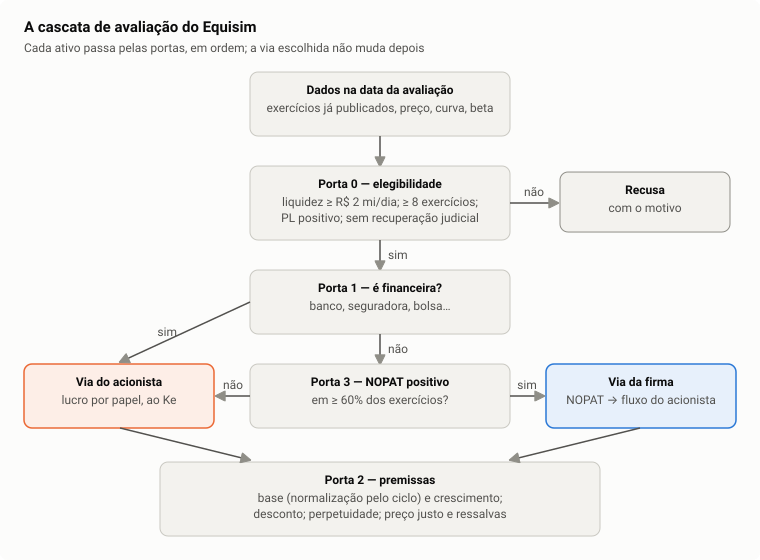

# 4. O fluxo de caixa descontado do Equisim, do dado ao preço justo

> **Para que serve este capítulo.** Aqui as peças dos capítulos 1 a 3 se juntam.
> O capítulo segue a ordem exata em que o motor trabalha: quem pode ser
> avaliado, por qual caminho, com qual lucro de partida, crescendo quanto,
> descontado a quê, até chegar ao preço por ação e aos números em volta dele.
>
> Tempo de leitura: 2 horas. Pré-requisitos: capítulos 1, 2 e 3.
> Os [casos](casos/) mostram cada passo com números reais.

---

## 4.1 A ideia em uma frase

> **Uma ação vale o dinheiro que ela vai entregar ao dono, para sempre, trazido
> a valor de hoje pela taxa que o dono exige.**

Todo o resto é a engenharia de estimar "o dinheiro que ela vai entregar" (o
fluxo) e "a taxa que o dono exige" (o desconto) sem inventar nada.

---

## 4.2 O mapa: a cascata de portas

O motor não aplica a mesma conta a toda empresa. Ele passa cada uma por uma
sequência de **portas**, e cada porta decide se a empresa segue e por qual
caminho.



| Porta | Pergunta | Se a resposta for "não" |
|---|---|---|
| **0 — elegibilidade** | Há dado e liquidez para avaliar? | recusa, com o motivo |
| **1 — setor** | É instituição financeira? | se sim, **via do acionista** (capítulo 5) |
| **3 — fluxo operacional** | O lucro operacional é positivo na maioria dos anos? | se sim, **via da firma**; se não, **via do acionista** |
| **2 — premissas** | Qual o lucro de partida e quanto ele cresce? | se o dado não sustenta, recusa |

A numeração segue a história do projeto (a Porta 2 veio antes da 3), não a
ordem da conta. **Uma vez escolhida a via, ela não muda** (decisão 102): se a
conta da via escolhida recusar, o ativo é recusado, em vez de ser mandado para a
outra via até alguma dar número.

### Porta 0 — quem pode ser avaliado

O motor recusa a empresa, dizendo por quê, quando:

- **falta liquidez**: o volume financeiro diário mediano dos últimos 90 pregões
  é menor que R$ 2 milhões. Uma ação que quase não negocia tem preço que não
  diz muito, e o beta dela sai contaminado;
- **falta história**: menos de oito exercícios publicados. Os testes de
  normalização e de crescimento precisam de série;
- **patrimônio líquido negativo** nos dois últimos exercícios (empresa
  tecnicamente insolvente);
- **recuperação judicial**.

Na entrada congelada de 14/09/2026, 376 ativos chegaram ao motor: 189 foram
recusados por liquidez, 34 por história curta e 4 por patrimônio negativo; os
demais recusados não tinham demonstrativo ou tiveram a estrutura de capital
recusada pela conta (capítulo 3, seção 3.10, e o [caso RENT3](casos/rent3.md)). Foram avaliados 97
([eligibility.dart](../../packages/equisim_core/lib/src/services/valuation/eligibility.dart)).

### Portas 1 e 3 — qual caminho

- **Instituição financeira** (bancos, seguradoras, bolsa, serviços financeiros)
  vai para a **via do acionista**: nelas a dívida é matéria-prima, e separar
  "operação" de "financiamento" não faz sentido (capítulo 5).
- As demais vão para a **via da firma** se o NOPAT foi positivo em pelo menos
  60% dos exercícios; senão, para a **via do acionista**, que parte do lucro
  líquido.

([compute_valuation.dart, `_route`](../../packages/equisim_core/lib/src/usecases/compute_valuation.dart);
[financial_sectors.dart](../../packages/equisim_core/lib/src/services/valuation/financial_sectors.dart).)

---

## 4.3 As duas vias, lado a lado

| | Via da firma | Via do acionista |
|---|---|---|
| Para quem | empresas não financeiras com operação lucrativa | bancos, seguradoras, e quem tem operação instável |
| Lucro de partida | NOPAT (lucro operacional depois do imposto) | lucro líquido por papel |
| Base de capital | capital investido (PL + dívida líquida) | patrimônio líquido |
| Retorno medido | ROIC | ROE |
| Fluxo | fluxo da firma, convertido em fluxo do acionista | lucro distribuível por papel |
| Taxa de desconto | custo do capital próprio (Ke) de cada ano | custo do capital próprio (Ke) de cada ano |
| Dívida | sai do fluxo, ano a ano (serviço da dívida) | já está dentro do lucro líquido |
| Modelo na tela | "DCF sobre fluxo da firma" | "DCF sobre lucro distribuível" |

As duas vias terminam descontando o dinheiro **do acionista** pelo custo **do
acionista**. A diferença é por onde elas chegam lá.

---

## 4.4 Porta 2, primeira saída: o lucro de partida (a base)

O ponto de partida é o lucro do último exercício publicado: NOPAT na via da
firma, lucro líquido por papel na do acionista. Antes de projetar, o motor
pergunta: **esse lucro é representativo?**

Ele compara o retorno do último ano (ROIC ou ROE) com o **retorno do ciclo**: a
mediana dos oito exercícios anteriores. Três guardas decidem:

1. **Guarda da tendência.** Se o retorno vem subindo (ou caindo) de forma
   estatisticamente clara há anos, a diferença para o passado não é acidente, é
   mudança de patamar — e a base é mantida. O teste é uma regressão do retorno
   contra o ano, com o erro de Newey-West (capítulo 6, seção 6.5), a 10% de
   significância, e a tendência só "domina" se o quanto ela explica em oito anos
   for pelo menos igual à diferença a corrigir.
2. **Guarda do capital externo (Φ).** Mede quanto do crescimento do capital veio
   de dinheiro de fora (emissão de ações, aquisição) em vez de lucro retido. Ela
   **declara**, não bloqueia: base crescida por aquisição não é comparável com o
   passado.
3. **Guarda do desvio.** O último ano destoa do ciclo? Sim, se a distância for
   maior que 1,5 desvio robusto (capítulo 6, seção 6.2) ou se a razão atual/ciclo
   sair de [0,75; 1,33].

Se o ano destoa e não há tendência que explique, a base é **normalizada**:

```
base = lucro do último ano × (retorno do ciclo ÷ retorno do último ano)
```

com o fator limitado a [1/3; 3] ("saturação").

Duas regras especiais:

- **Commodity tem precedência do ciclo.** Em mineração, petróleo, siderurgia,
  celulose e petroquímica, a alta de um ciclo parece tendência e não é. Ali a
  reversão ao ciclo vale mesmo com tendência significante (decisão 28).
- **Trava de saúde.** Se o lucro ou o EBITDA caiu mais de 50% em três anos, a
  base não é normalizada **para cima**: uma empresa que quebrou o modelo de
  negócio não volta à média do passado. Commodity é isenta, porque ali a queda
  entre o pico e o vale é o preço do insumo (decisão 30).

E um caso de borda: se o último ano deu **prejuízo** mas o ciclo é lucrativo, a
base é **reconstruída** como retorno do ciclo × capital de hoje (decisão 53), e
isso vira ressalva na tela.

([compute_valuation.dart, `_saida1` e `_fluxoBase`](../../packages/equisim_core/lib/src/usecases/compute_valuation.dart);
[growth_guards.dart](../../packages/equisim_core/lib/src/services/valuation/growth_guards.dart).)

---

## 4.5 Porta 2, segunda saída: quanto cresce

O crescimento inicial `g` sai da **história da própria empresa**: a mediana das
variações anuais da base de capital (capital investido ou patrimônio). A base
de capital, e não o lucro, porque ela é o que o reinvestimento acumula
(`g = b × ROIC`, capítulo 2).

O motor confere se esse número é confiável:

- o **erro-padrão** do crescimento estimado precisa ser de no máximo 3 pontos;
- a mediana precisa **concordar** com o crescimento de uma regressão do
  logaritmo da base contra o ano (capítulo 6, seção 6.6). Se discordarem além do
  que o erro explica e por mais que max(2 pontos; 25% do crescimento), a série
  não diz um crescimento só.

| Resultado | O que o motor usa | O que aparece |
|---|---|---|
| identificado | a mediana | nada especial |
| não identificado, mas a empresa consegue financiar crescer com a inflação | a inflação (4,92% em 14/09/2026) | ressalva "crescimento não identificado" |
| nem isso | zero | ressalva e aviso de premissa conservadora |

([growth_guards.dart, `dispersion` e `anchorIsFundable`](../../packages/equisim_core/lib/src/services/valuation/growth_guards.dart).)

---

## 4.6 Os dez anos de projeção

Com base e crescimento, o motor projeta dez anos (decisão 115). Três coisas
mudam ano a ano, todas em linha reta do ano 1 ao ano 10:

**1. O crescimento cai até o perpétuo.**

```
g_t = g − (g − g∞) × (t − 1) ÷ 9
g∞ = menor entre g e o crescimento nominal da economia, limitado a [−5%; teto]
```

Nenhuma vantagem dura para sempre: a concorrência chega aos poucos. Em
14/09/2026 o teto era 6,78% ao ano (capítulo 1, seção 1.6).

**2. O retorno sobre o capital converge ao custo de capital.**

```
ROIC_t = ROIC_base − (ROIC_base − custo_t) × (t − 1) ÷ 9
```

Essa é a hipótese de **concorrência**: retorno acima do custo atrai
concorrentes, que o empurram para baixo. No ano 10 o retorno encontra o custo
(McKinsey, *Valuation*, capítulo "Return on invested capital").

**3. A retenção é a que financia o crescimento daquele ano.**

```
b_t = g_t ÷ ROIC_t     (entre 0 e 95%)
lucro_t = lucro_{t−1} × (1 + g_t)
fluxo livre_t = lucro_t × (1 − b_t)
```

Uma consequência que vale entender: **crescer mais nem sempre vale mais.** Se o
retorno sobre o capital está abaixo do custo, cada real reinvestido rende menos
do que custa, e mais crescimento *reduz* o valor. Isso acontece em mais da
metade dos 97 ativos avaliados em 14/09/2026 (item B38 do
[plano](../plano-motor-de-referencia.md)) e explica por que o cenário
"Otimista" da tela às vezes sai abaixo do "Pessimista" (seção 4.11).

---

## 4.7 O valor terminal: tudo depois do ano 10

Depois do ano 10, o motor resume o resto da vida da empresa numa perpetuidade
(capítulo 1, seção 1.7). A pergunta é: **o que acontece com o retorno do
capital novo depois do ano 10?** Há três respostas, e o motor escolhe uma:

### Retorno neutro (o padrão)

O capital novo rende exatamente o custo de capital: crescer não cria nem
destrói valor. Nesse caso a fórmula de Gordon simplifica, e o crescimento sai
da conta:

```
VT = lucro do ano 11 ÷ taxa de equilíbrio
```

É a hipótese mais conservadora e a que dispensa adivinhar `g∞` (McKinsey chama
de "value driver formula" com RONIC = WACC).

### Vantagem competitiva residual (o "moat")

Algumas empresas sustentam retorno acima do custo por muito tempo (marca,
tecnologia, escala). O motor mede, na história da própria empresa, **quanto do
excedente de um ano sobrevive ao ano seguinte** — a persistência `φ`, estimada
por uma autorregressão (capítulo 6, seção 6.7). Depois de dez anos sobra `φ¹⁰`
do excedente:

```
ROIC∞ = custo∞ + φ¹⁰ × (ROIC do ciclo − custo∞)
VT = lucro do ano 11 × (1 − g∞ ÷ ROIC∞) ÷ (custo∞ − g∞)
```

Só vale com pelo menos oito exercícios, crescimento orgânico (Φ ≤ 0,60),
retorno do ciclo acima do custo e persistência estimável; e nunca para
concessão (decisões 36 e 50). Na WEGE3, `φ` = 0,84 e sobram 17% do excedente
(ver o [caso](casos/wege3.md)).

### Concessão com prazo

Uma concessionária (saneamento, energia, rodovia) tem contrato que acaba. O
excedente sobre o capital existente dura só até o fim do contrato, e depois o
capital volta (por indenização ou renovação a tarifa de custo). O motor lê o
prazo das outorgas e usa (decisão 88):

```
VT = capital no ano 10 + lucro econômico × anuidade dos anos que restam
```

([dcf.dart, `terminalValue`](../../packages/equisim_core/lib/src/services/valuation/dcf.dart).)

---

## 4.8 Descontar

Cada fluxo é trazido a hoje pelo fator acumulado das taxas de cada ano, com o
ajuste de meio de ano (capítulo 1, seções 1.5 e 1.8):

```
VP_t = fluxo_t × √(1 + k_t) ÷ [(1 + k_1) × (1 + k_2) × … × (1 + k_t)]
VP(VT) = VT × √(1 + k∞) ÷ [(1 + k_1) × … × (1 + k_10)]
```

A taxa `k_t` é o **custo do capital próprio do ano t**, montado sobre o forward
daquele ano da curva do Tesouro e, quando possível, com o beta recalculado
conforme a dívida daquele ano (capítulo 3, seção 3.10).

---

## 4.9 Da firma ao acionista (só na via da firma)

A via da firma projeta o fluxo que a operação gera para **todos** os
financiadores (sócios e credores). O acionista só fica com o que sobra depois
de servir a dívida. O motor faz essa passagem **ano a ano**:

```
fluxo do acionista_t = fluxo da firma_t − serviço da dívida_t
serviço da dívida_t = juro da dívida bruta × (1 − 34%)
                    − rendimento do caixa × (1 − 34%)
                    − dívida nova que mantém a alavancagem
```

A dívida e o caixa crescem junto com a empresa (alavancagem constante), então
todo ano entra dívida nova — que é dinheiro para o acionista.

**Por que não simplesmente "valor da firma − dívida"?** Porque quando a dívida
é grande, o valor das ações é a diferença entre dois números grandes e
parecidos, e qualquer erro de 5% no valor da firma vira um erro de 50% ou mais
no valor por ação. Descontar o fluxo do acionista direto evita essa
amplificação (decisões 43 e 102). As duas contas dão o mesmo resultado quando as
taxas são coerentes — a identidade está travada por teste.

Depois do desconto:

```
capital próprio = VP(explícito) + VP(terminal) − parte dos minoritários
                + capital emitido depois do balanço
preço justo = capital próprio ÷ número de papéis
```

- **Minoritários**: a demonstração soma 100% das controladas, mas o acionista
  da controladora não é dono de tudo (decisão 49).
- **Capital posterior**: ações emitidas depois do último balanço estão na
  contagem de papéis, mas o dinheiro delas não está no patrimônio publicado
  (item B28).

---

## 4.10 Os números em volta do preço justo

A tela de avaliação mostra mais do que o preço justo. Cada número responde a
uma pergunta diferente:

| Cartão | Pergunta | Como é calculado |
|---|---|---|
| **Preço justo** | quanto vale, pelas premissas do motor? | seções 4.4 a 4.9 |
| **Upside** | quanto falta até o justo? | `(justo − preço) ÷ preço`, total, sem prazo |
| **Margem de segurança** | a que preço eu compraria com folga? | `justo × (1 − margem)`; zero por padrão |
| **Taxa de desconto** | que taxa desconta o ano 1? | o custo do capital próprio do ano 1 |
| **Faixa calibrada** | onde o preço costuma estar daqui a 12 e 36 meses? | seção 4.12 |
| **Cenários** | quanto o justo muda se eu errar a premissa? | seção 4.11 |
| **Sensibilidade** | idem, em barra | os mesmos cenários |
| **Múltiplos de pares** | o nível faz sentido perto dos concorrentes? | seção 4.13 |
| **Ressalvas** | onde este número é frágil? | seção 4.14 |

---

## 4.11 Cenários e Monte Carlo: sensibilidade, não probabilidade

**Cenários fixos** (padrão). Três conjuntos de premissas:

| Cenário | Crescimento inicial | Desconto (todos os anos e perpetuidade) |
|---|---|---|
| Pessimista | −3 pontos | +2 pontos |
| Base | o do motor | o do motor |
| Otimista | +3 pontos | −2 pontos |

**Monte Carlo** (chave na tela). 10.000 sorteios: crescimento em ±4 pontos,
desconto em ±2 pontos e crescimento perpétuo em ±1 ponto, cada um numa
distribuição triangular com o pico na premissa do motor. A tela mostra os
percentis 5, 50 e 95 e a fração de sorteios acima do preço de mercado.

**O que eles não são.** Nas coortes históricas, a faixa entre pessimista e
otimista conteve o que de fato aconteceu com o preço em só 8% dos casos, contra
90% que um intervalo de confiança prometeria (decisão 92). Os cenários dizem
**quanto o número depende das premissas**, e não onde o preço vai estar.

**O rótulo que engana (item B38).** O otimista soma crescimento. Quando a
empresa rende abaixo do custo de capital, crescer destrói valor, e o "Otimista"
pode sair abaixo do "Pessimista" — aconteceu em 17 dos 77 ativos da via da
firma em 14/09/2026. A conta está certa; o nome do cenário é que supõe que
crescer é sempre bom. A correção depende de decisão
([limitações](../validacao/limitacoes.md)).

([scenario_engine.dart](../../packages/equisim_core/lib/src/services/valuation/scenario_engine.dart).)

---

## 4.12 A faixa calibrada: a incerteza medida

A faixa calibrada é a resposta honesta a "quão errado este número costuma
estar?". Ela não sai das premissas: sai do que aconteceu com avaliações
passadas (decisões 92, 100 e 124).

```
faixa = preço de hoje × exp(a + b × ln(justo ÷ preço) + σ × z)
```

- `σ` é a volatilidade do papel no último ano (capítulo 3, seção 3.1);
- `a` e `b` foram medidos nas coortes trimestrais do backtest (de 2018 a 2025
  em 12 meses, de 2018 a 2023 em 36): `b` é pequeno (0,02 em 12 meses, 0,07 em
  36), o que quer dizer que **o preço converge pouco ao preço justo**;
- `z` são os limites que, fora da amostra, contiveram 80% dos casos.

Medida fora da amostra, a faixa de 80% conteve o preço mais os proventos em
79,7% dos casos em 12 meses e 79,6% em 36. Por isso a tela diz "8 de cada 10".
O preço justo entra com peso pequeno porque essa é a evidência: ele explica
pouco do preço futuro.

([calibrated_band.dart](../../packages/equisim_core/lib/src/services/valuation/calibrated_band.dart).)

---

## 4.13 Múltiplos de pares: uma segunda leitura

O motor compara o preço justo com o que os concorrentes valem na bolsa:

```
preço pelo P/L    = mediana do P/L dos pares × lucro por papel
preço pelo P/VP   = mediana do P/VP dos pares × patrimônio por papel
preço pelo EV/EBITDA = (mediana do EV/EBITDA × EBITDA − dívida líquida) ÷ papéis
```

Exige pelo menos cinco pares do mesmo subsetor, e EV/EBITDA é recusado para
financeiras. A mediana das leituras é a "leitura por pares". Se ela divergir do
preço justo em mais de 50%, a tela avisa — **mas o preço justo não muda**
(decisão 118). A segunda leitura é teste de sanidade, e não um segundo modelo.

([peer_multiples.dart](../../packages/equisim_core/lib/src/services/valuation/peer_multiples.dart).)

---

## 4.14 Ressalvas: onde o número é frágil

| Ressalva | Quando aparece | Por que importa |
|---|---|---|
| Terminal pesado | o valor terminal passa de 80% do capital próprio | o número depende quase todo do que acontece depois de dez anos |
| Crescimento não identificado | `g` veio da inflação ou é zero | a série não disse quanto a empresa cresce |
| Escala incerta | as contagens de papéis divergem e não há contagem oficial | o preço por papel pode estar dividido errado |
| Base normalizada forte | o fator de normalização passou de 2 ou ficou abaixo de ½ | o lucro de partida é muito diferente do publicado |
| Prazo determinado | concessão com contrato | o valor depende do prazo lido nas outorgas |
| Base reconstruída | o último ano deu prejuízo e a base veio do ciclo | a partida é uma estimativa, não um lucro publicado |
| Ponte frágil | o capital próprio é menos de 35% do valor da firma | o valor por ação é resíduo de uma subtração frágil |

([compute_valuation.dart, `_diagnose`](../../packages/equisim_core/lib/src/usecases/compute_valuation.dart);
[domain_copy.dart](../../lib/presentation/shared/domain_copy.dart).)

---

## 4.15 O que o preço justo quer dizer (e o que não quer)

O preço justo é **o valor que as premissas do motor implicam**, calculadas com
dado público e regra fixa. Ele **não** é previsão de preço. Três fatos medidos
para ter em mente:

1. **O motor é sistematicamente mais pessimista que o mercado.** Com os dados
   de 14/09/2026 e o motor de 01/10/2026, o upside mediano dos 108 avaliados é
   −37%, e só 28 tinham upside positivo. Com o prêmio de mercado tirado do
   próprio preço da bolsa (1,21%, decisão 142) o desacordo diminuiu — com os 5,5%
   de antes eram −45% —, mas não acabou: ele é com o conjunto das premissas —
   juros de 14% na curva inteira, retorno convergindo ao custo em dez anos —, e
   não com um parâmetro isolado.
2. **A ordenação não está comprovada.** Comprar os de maior upside não bateu os
   de menor upside de forma estatisticamente clara nas coortes de 2018 a 2023
   (decisão 140). O motor serve para **entender** uma empresa, e não para
   decidir sozinho.
3. **A incerteza é grande e está medida**: é a faixa calibrada.

## Para estudar mais

- **Koller, Goedhart e Wessels (McKinsey), *Valuation*** — capítulos "Frameworks
  for valuation", "Continuing value" e "Moving from enterprise value to value
  per share". É a base da convergência do ROIC, do retorno neutro e da passagem
  firma → acionista.
- **Damodaran, *Valuation*** — capítulos "Estimating growth" e "Closure in
  valuation: estimating terminal value".
- **Póvoa, *Valuation: como precificar ações*** — o fluxo de caixa da firma com
  exemplos brasileiros.
- **Damodaran Online**, planilhas gratuitas "fcffginzu" e "fcfeginzu" — ótimas
  para refazer uma avaliação à mão e comparar com o Equisim.
