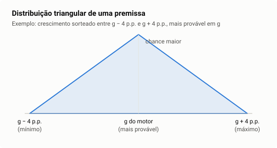

# 6. A estatística que o motor usa

> **Para que serve este capítulo.** O motor não confia num número só porque ele
> saiu de uma conta: ele pergunta **quão confiável** é cada estimativa, e muda o
> que faz conforme a resposta. Este capítulo explica, do zero, as ferramentas
> estatísticas que aparecem no motor, no painel de logs e na validação.
>
> Tempo de leitura: 1 hora e meia. Não precisa de nada antes; os exemplos usam
> números pequenos.

---

## 6.1 Média e mediana: o meio de um conjunto

Retornos de uma empresa em sete anos: 12%, 14%, 13%, 15%, 11%, 13% e **80%**
(num ano ela vendeu uma fábrica).

- **Média**: soma ÷ quantidade = 158 ÷ 7 = **22,6%**.
- **Mediana**: o valor do meio depois de ordenar (11, 12, 13, **13**, 14, 15,
  80) = **13%**.

A média foi puxada pelo ano atípico; a mediana, não. Por isso o motor usa a
mediana quase sempre: para o retorno do ciclo, para o crescimento, para a
alíquota, para os múltiplos dos pares. Estatísticas que um valor extremo não
consegue arrastar se chamam **robustas**.

**No código:** [inference.dart, `median`](../../packages/equisim_core/lib/src/services/valuation/inference.dart).

---

## 6.2 Quanto os dados se espalham: desvio-padrão e MAD

O **desvio-padrão** mede a distância típica dos valores até a média:

```
desvio-padrão = √( soma de (valor − média)² ÷ (n − 1) )
```

Como a média, ele é sensível a extremos. A versão robusta é o **MAD** (desvio
absoluto mediano): a mediana das distâncias até a mediana, multiplicada por
1,4826 para ficar na mesma escala do desvio-padrão quando os dados são
"normais".

No exemplo: distâncias até 13% = 1, 1, 0, 0, 2, 2, 67 → mediana = 1 → MAD =
1,48 ponto. O ano de 80% está a (80 − 13) ÷ 1,48 = 45 MADs do centro: é atípico
sem discussão.

**No motor:** a Guarda 3 (capítulo 4, seção 4.4) diz que o último ano "destoa do
ciclo" quando está a mais de **1,5 MAD** da mediana — o "z robusto".

---

## 6.3 A distribuição normal e os percentis

Muitas grandezas, somadas de muitos efeitos pequenos, se distribuem numa forma
de sino: a **distribuição normal**. Nela:

- 68% dos valores ficam a até 1 desvio-padrão da média;
- 95% a até 1,96 desvio-padrão;
- 99,7% a até 3.

Um **percentil** é o valor abaixo do qual está uma certa fração dos dados. O
percentil 5 (P5) de 10.000 sorteios é o 500º menor valor.

**No motor:** o Monte Carlo mostra P5, mediana e P95 dos 10.000 preços
sorteados (capítulo 4, seção 4.11).

---

## 6.4 Regressão linear: a reta que melhor passa pelos pontos

Dados pares (x, y) — por exemplo, o retorno do Ibovespa (x) e o de uma ação (y)
em cada dia —, a **regressão linear** acha a reta `y = a + b × x` que minimiza a
soma dos quadrados das distâncias verticais dos pontos até ela ("mínimos
quadrados").

```
b (inclinação) = covariância(x, y) ÷ variância(x)
a (intercepto) = média(y) − b × média(x)
```

A inclinação responde: **quando x sobe 1, quanto y sobe, em média?**

**No motor**, regressões aparecem em quatro lugares:

| Onde | x | y | A inclinação é… |
|---|---|---|---|
| beta (capítulo 3) | retorno diário do Ibovespa | retorno diário da ação | o beta |
| Guarda 1 (tendência) | ano | retorno sobre o capital | quanto o retorno muda por ano |
| crescimento (seção 6.6) | ano | logaritmo da base de capital | o crescimento contínuo |
| persistência (seção 6.7) | excedente de um ano | excedente do ano seguinte | quanto do excedente sobrevive |

---

## 6.5 Quão certa é a inclinação? Erro-padrão e teste t

Se os dados tivessem sido um pouco diferentes, a reta sairia outra. O
**erro-padrão** da inclinação mede quanto ela costuma variar por esse motivo.

A **estatística t** compara a inclinação com o seu erro:

```
t = inclinação ÷ erro-padrão
```

- `t` perto de zero: a inclinação pode ser só ruído;
- `|t|` grande (acima de ~2): é improvável que a inclinação verdadeira seja
  zero. Dizemos que ela é **estatisticamente significante**.

O limite exato vem da **distribuição t de Student** e do **nível de
significância** (α): a chance aceita de chamar de real algo que é ruído. O motor
usa α = 10% na Guarda 1 e no teste de crescimento.

**Newey-West.** O erro-padrão comum supõe que cada ponto é independente do
anterior. Numa série anual de retornos isso é falso: um ano bom tende a vir
seguido de outro bom. Ignorar isso faz o erro parecer menor do que é, e o `t`,
maior. O erro de **Newey-West** (1987) corrige para essa dependência. O painel
de logs mostra "t de Newey-West" na normalização da base: na WEGE3, 6,09 — a
tendência de alta do retorno é clara.

**Exemplo de leitura (WEGE3, 14/09/2026):** o retorno sobre o capital subiu 2,05
pontos por ano, com `t` de Newey-West de 6,09. A tendência é significante e, em
oito anos, explica mais que a diferença entre o último ano (35,9%) e o ciclo
(32,0%). Conclusão do motor: é mudança de patamar, e a base não é normalizada.

---

## 6.6 Crescimento pelo logaritmo, e o método delta

Uma base que cresce a 10% ao ano forma uma curva exponencial. O **logaritmo**
dela forma uma reta, cuja inclinação `b` dá o crescimento:

```
ln(base_t) = a + b × ano      ⇒      crescimento = e^b − 1
```

O motor estima o crescimento de dois jeitos — a mediana das variações anuais e
essa regressão — e confere se concordam. O erro-padrão do crescimento vem do
erro de `b` pelo **método delta** (uma aproximação que propaga o erro de uma
estimativa para uma função dela): `erro(g) ≈ (1 + g) × erro(b)`.

A **discordância** é a diferença entre os dois crescimentos dividida pelo erro.
Na ITUB4: mediana 9,79%, regressão 8,24%, erro 0,5 ponto, discordância 3,07
contra crítico de 1,76 — mas a diferença (1,55 ponto) é menor que o limite de
max(2 pontos; 25% × 9,79%) = 2,45 pontos, e o crescimento é aceito.

---

## 6.7 Persistência: a autorregressão AR(1)

Uma série tem **memória** quando o valor de um ano ajuda a prever o do ano
seguinte. O modelo mais simples de memória é o **AR(1)** (autorregressivo de
ordem 1):

```
excedente_t = constante + φ × excedente_{t−1} + ruído
```

- `φ` perto de 1: o excedente dura muito (vantagem persistente);
- `φ` perto de 0: o excedente some de um ano para o outro.

Depois de `N` anos, sobra `φ^N` do excedente inicial. Com `φ` = 0,84 (WEGE3),
depois de 10 anos sobram 0,84¹⁰ = 17%. Com `φ` = 0,41 (VALE3), sobram 0,01%.

**No motor:** é o que decide o retorno terminal com vantagem competitiva
(capítulo 4, seção 4.7). O motor limita `φ` a 0,90 e exige pelo menos quatro
pares de anos. Ele **não** corrige o viés de amostra pequena (o AR(1) tende a
subestimar `φ`), porque a correção, com tão poucos pares, dominava o próprio
dado — escolha conservadora e declarada (decisão 36).

---

## 6.8 Encolhimento: juntar o dado com o que se sabe antes

Quando uma estimativa é imprecisa, faz sentido puxá-la na direção de um valor
de referência, **mais** quanto mais imprecisa ela for:

```
peso da medida = precisão da medida ÷ (precisão da medida + precisão da referência)
estimativa final = peso × medida + (1 − peso) × referência
precisão = 1 ÷ erro²
```

É uma média ponderada pela confiança, com fundamento na estatística bayesiana.
O motor faz isso com o beta (referência: o beta do setor; capítulo 3, seção
3.4). O projeto também usou a mesma fórmula para testar o prêmio de mercado
histórico, e ela devolveu 5,49% (decisão 116).

---

## 6.9 Sorteio: distribuição triangular e Monte Carlo

**Monte Carlo** é responder "e se?" sorteando muitas vezes. Para cada um de
10.000 sorteios, o motor escolhe um crescimento, um desconto e um crescimento
perpétuo, e recalcula o preço justo inteiro.

Cada premissa é sorteada de uma **distribuição triangular**: um mínimo, um
máximo e um pico (o valor mais provável), com a chance caindo em linha reta do
pico até as pontas. É a distribuição mais simples que diz "o valor do motor é o
mais provável, e desvios maiores são menos prováveis".



O gerador de números aleatórios tem **semente fixa**: o mesmo ativo, na mesma
data, dá sempre os mesmos 10.000 sorteios. Isso é exigência do projeto
(determinismo; [CLAUDE.md](../../CLAUDE.md), seção 3.2).

---

## 6.10 Validar: testar o motor contra o que aconteceu

As ferramentas acima servem ao motor. As seguintes servem para **julgar o
motor**.

### Backtest e coortes

Um **backtest** roda o motor numa data do passado, com só o que se sabia
naquela data (visão *point-in-time*, capítulo 2, seção 2.9), e compara com o que
aconteceu depois. Cada data é uma **coorte**. O Equisim roda coortes
trimestrais de 2018 a 2025, incluindo as empresas que depois saíram da bolsa —
senão o teste só veria as sobreviventes (**viés de sobrevivência**).

### Dentro e fora da amostra

Se você ajusta um modelo olhando os dados, ele sempre parece bom nesses dados.
O teste honesto é **fora da amostra**: medir em dados que não foram usados para
ajustar. A faixa calibrada foi ajustada numa parte das coortes e medida na
outra (79,7% de cobertura para 80% prometidos, em 12 meses).

### Cobertura e calibração

Uma faixa de "80%" é **calibrada** quando, medida em muitos casos, contém o
resultado em cerca de 80% deles. O critério do projeto aceita até 5 pontos de
distância (75% a 85%).

### Correlação de postos (IC)

Para saber se o motor **ordena** bem as ações (as de maior upside rendem mais?),
usa-se a correlação entre as **posições** (postos) do upside e as posições do
retorno realizado, e não os valores. É a correlação de Spearman, chamada no
mercado de *information coefficient* (IC). IC = 0 é ordenação aleatória.

### Fama-MacBeth e o t corrigido

O teste de habilidade faz uma regressão em cada coorte (retorno contra upside,
controlando pelo book-to-market) e depois olha a **média** das inclinações ao
longo das coortes, com o seu erro (Fama e MacBeth, 1973). Coortes trimestrais
medidas em 36 meses **se sobrepõem** (compartilham até 33 meses), e o `t` comum
sai inflado; o projeto corrige pelo tamanho da sobreposição e compara com um
limiar próprio, obtido por simulação (2,70 para 22 coortes; decisão 96).

### Poder do teste: não achar não é provar que não existe

O **poder** é a chance de um teste detectar um efeito que existe. Com poucas
coortes, o poder é baixo: um efeito real pode passar despercebido. O Equisim
mediu isso: com a série brasileira disponível, o menor efeito que o teste
enxerga com 80% de chance é 0,70, e o efeito medido foi 0,010 (decisão 140;
remedição de 02/10/2026).
Leitura correta:

> "O teste não encontrou habilidade de ordenação, **e** não teria poder para
> encontrar um efeito do tamanho que se costuma ver na literatura." Não é o
> mesmo que "o motor não tem habilidade".

Por isso o critério virou **"habilidade testada, com o poder declarado"**, e a
réplica fora da amostra continua, com leituras em 2029 e 2031 (capítulo 7).

## Resumo do capítulo

| Ferramenta | Pergunta | Onde aparece |
|---|---|---|
| Mediana | qual o valor típico, sem se deixar arrastar? | ciclo, crescimento, alíquota, pares |
| MAD e z robusto | o último ano é atípico? | Guarda 3 |
| Regressão | quanto y muda quando x muda? | beta, tendência, crescimento, persistência |
| Erro-padrão, t | a inclinação é real ou ruído? | Guarda 1, crescimento, habilidade |
| Newey-West | e se os erros tiverem memória? | Guarda 1, habilidade |
| Método delta | qual o erro de uma função da estimativa? | crescimento |
| AR(1) | quanto do excedente sobrevive? | vantagem competitiva |
| Encolhimento | como juntar dado ruidoso e referência? | beta, prêmio de mercado |
| Triangular, Monte Carlo | quanto o preço muda se as premissas variarem? | cenários sorteados |
| Fora da amostra, cobertura | a faixa promete o que cumpre? | faixa calibrada |
| IC, Fama-MacBeth, poder | o motor ordena bem? o teste enxergaria? | validação (R3) |

## Para estudar mais

- **Wooldridge, *Introdução à Econometria: uma abordagem moderna*** (Cengage) —
  regressão, erro-padrão, teste t, séries temporais. O livro-texto padrão.
- **Morettin e Bussab, *Estatística Básica*** (Saraiva) — média, mediana,
  desvio, distribuições. Em português, com exercícios.
- **Khan Academy**, trilha "Estatística e probabilidade" (gratuita, em
  português).
- **StatQuest** (YouTube, Josh Starmer) — vídeos curtos sobre regressão, p-valor
  e poder estatístico, com legenda.
- Para a bibliografia do trabalho: Newey e West (1987), *Econometrica*; Fama e
  MacBeth (1973), *Journal of Political Economy*.
