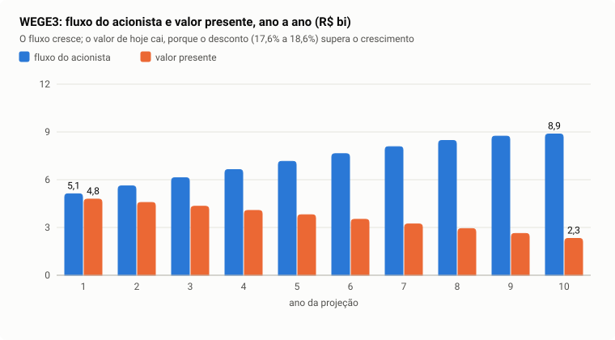
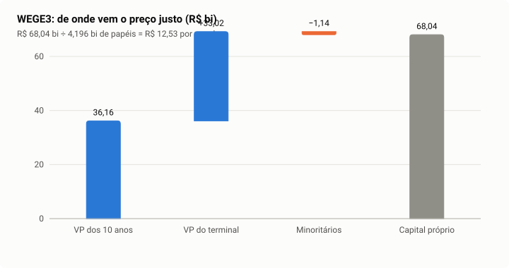

# Caso WEGE3 — WEG, via da firma, do início ao fim

> **O que este caso mostra.** Uma empresa industrial, com mais caixa que dívida,
> retorno sobre o capital muito alto e crescimento consistente. É o caminho
> completo da **via da firma**, com vantagem competitiva residual na
> perpetuidade. Cada passo abaixo é um passo do painel de logs do aplicativo, na
> mesma ordem, com a conta refeita e o porquê.
>
> **Data da avaliação:** 14/09/2026, sobre a entrada congelada do gabarito
> (os dados estão em [dados/WEGE3.json](dados/WEGE3.json), gerados por
> `dart run tool/casos_de_estudo.dart`).
>
> **Resultado:** preço justo **R$ 16,22**, contra preço de mercado de
> R$ 50,74 — upside de **−68,0%**. A seção 9 explica por que a distância é tão
> grande.

---

## 1. Os dados de partida

| Grandeza (exercício 2025) | Valor | De onde vem |
|---|---:|---|
| Receita líquida | R$ 40,80 bi | DRE (CVM) |
| EBIT | R$ 8,00 bi | DRE |
| Lucro líquido | R$ 6,78 bi | DRE |
| Alíquota efetiva do ano | 16,8% | imposto ÷ lucro antes do imposto |
| Dívida bruta | R$ 4,59 bi | balanço |
| Caixa e aplicações | R$ 7,28 bi | balanço |
| **Dívida líquida** | **−R$ 2,69 bi** | caixa maior que a dívida |
| Patrimônio líquido | R$ 18,55 bi | VPA × ações do exercício |
| Minoritários | R$ 1,14 bi | balanço |
| Preço de mercado | R$ 50,74 | último fechamento |
| Exercícios publicados | 16 (2010–2025) | CVM |

O motor usa os 16 exercícios para medir ciclo, tendência e crescimento, e o
último para a base.

---

## 2. Quantas ações contam (papel negociado e contagem)

**Razão da unit.** O motor confere se WEGE3 é um "pacote" de ações:
`4.197.318.000 ações × R$ 50,74 ÷ R$ 216,96 bi de valor de mercado = 0,98`,
que arredonda para **1**: cada papel é uma ação.

**Contagem da ponte.** Três contagens disponíveis:

| Fonte | Papéis |
|---|---:|
| valor de mercado ÷ preço | 4.275.904.020 |
| demonstrações | 4.197.318.000 |
| **registro oficial da B3, sem tesouraria** | **4.195.695.973** |

As duas da fonte concordam (diferença de 1,9%, dentro da banda de 1,5×), e o
registro oficial da B3 de 14/09/2026 é adotado, porque ele desconta as ações em
tesouraria, que não recebem nada (decisão 83).

> **Por quê:** o preço justo é "capital próprio ÷ papéis". Dividir pelo número
> errado erra o preço na mesma proporção.

---

## 3. Qual caminho (Portas 0, 1 e 3)

- **Porta 0:** liquidez, histórico (16 anos) e patrimônio positivo — passa.
- **Porta 1:** setor "bens industriais" — não é financeira.
- **Porta 3:** NOPAT positivo em pelo menos 60% dos exercícios — **via da
  firma**.

---

## 4. O custo do capital próprio de hoje (CAPM)

```
Ke = Rf + β × prêmio = 14,09% + 0,7139 × 1,21% = 14,09% + 0,86% = 14,95%
```

- **Rf = 14,09%**: o CDI dos últimos 63 pregões, anualizado.
- **β = 0,7139**: regressão de cinco anos de retornos diários da WEG contra o
  Ibovespa, com 32 proventos reinvestidos, encolhida para o setor (a medida é
  precisa e o peso dela é quase 1). A WEG oscila menos que o mercado.
- **Prêmio = 1,21%**: a média de dez anos do prêmio implícito no preço da bolsa
  (decisão 142; capítulo 3, seção 3.7).

Este Ke de 14,95% é o "do dia": o da tela de metas e o do WACC estático. O
desconto de cada ano usa o forward daquele ano (passo 8).

> **Teoria:** CAPM (Sharpe, 1964). Capítulo 3, seção 3.8.

---

## 5. O lucro de partida (normalização pelo ciclo)

**Alíquota estrutural.** A mediana das alíquotas efetivas dos exercícios é
**16,0%** — a WEG paga menos que 34% por incentivos e juros sobre capital
próprio, e isso é regime, não acaso.

**NOPAT de 2025:**

```
NOPAT = EBIT × (1 − 16,0%) = 8.000 × 0,84 = R$ 6.718,7 mi
```

(o resultado de coligadas foi negativo e não entra; capítulo 2, seção 2.4).

**Retorno do último ano × ciclo:**

```
ROIC 2025 = NOPAT 2025 ÷ capital investido 2024 = 6.718,7 ÷ 18.724,4 = 35,88%
ROIC do ciclo = mediana dos oito exercícios anteriores (2017–2024) = 31,98%
```

**As três guardas:**

| Guarda | Resultado | Leitura |
|---|---|---|
| 1 — tendência | inclinação de +2,05 p.p./ano, `t` de Newey-West = 6,09 | **domina**: o retorno sobe de forma clara há anos |
| 2 — capital externo | Φ = 0,08 | crescimento orgânico, base comparável |
| 3 — desvio | dentro da banda e do desvio robusto | o último ano não destoa |

**Conclusão: base mantida** (fator 1,0). O último ano não é um acidente: é o
patamar atual de uma empresa cujo retorno vem subindo.

> Um detalhe do painel: "queda no triênio (%) −58,58" quer dizer que o lucro
> **subiu** 58,58% em três anos (queda negativa). A trava de saúde só age com
> queda acima de 50%.

> **Teoria:** normalização pelo ciclo (Damodaran, "normalized earnings");
> regressão com erro de Newey-West (capítulo 6, seção 6.5).

---

## 6. Quanto cresce

```
g pela mediana das variações do capital investido  = 10,84% a.a.
g pela regressão do logaritmo do capital            = 11,43% a.a.
erro-padrão de g                                    = 0,70 p.p.
discordância = |10,84 − 11,43| ÷ 0,70 = 0,85  (crítico 1,76)
```

O erro é pequeno (menos de 3 pontos) e as duas medidas concordam: **crescimento
identificado, g = 10,84%**. A retenção observada no passado (55%) é compatível:
com ROIC de 36%, crescer 10,8% exige reter 30%.

> **Teoria:** `g = b × ROIC` (McKinsey, *Valuation*). Capítulo 4, seção 4.5.

---

## 7. O WACC de hoje

| Peça | Valor |
|---|---:|
| E (papéis × preço) | R$ 212,89 bi |
| Dívida bruta | R$ 4,59 bi |
| Caixa | R$ 7,28 bi |
| E + dívida líquida | R$ 210,20 bi |
| Kd = Rf + prêmio (alavancagem −0,30×: caixa líquido → 1,0%) | 15,09% |

```
peso do capital próprio = 212,89 ÷ 210,20 = 1,0128
peso da dívida bruta    = 4,59 ÷ 210,20   = 0,0218
peso do caixa           = 7,28 ÷ 210,20   = 0,0346

WACC = 1,0128 × 14,95% + 0,0218 × 15,09% × (1 − 34%) − 0,0346 × 14,09% × (1 − 34%)
     = 15,14% + 0,22% − 0,32% = 15,04%
```

O peso do capital próprio passa de 100% porque a WEG tem **caixa líquido**: o
caixa rende só a taxa livre de risco (depois do imposto), menos que o Ke, e
puxa a média para cima. O WACC fica **acima** do Ke — o aviso da tela diz isso.

A despesa financeira publicada daria um "custo da dívida" de 47,3% ao ano, o
que é absurdo para a WEG: ela inclui variação cambial e outros itens. Por isso o
motor não usa esse número (decisão 31) e a cobertura sai da conta do prêmio
(decisão 130).

> **Teoria:** WACC com caixa a Rf (decisão 113). Capítulo 3, seções 3.9 e
> 3.10.

---

## 8. A taxa de cada ano (curva do Tesouro e ponto fixo)

Os forwards de um ano da curva dos prefixados de 10/09/2026 vão de 13,62% (ano
1) a 14,63% (ano 5) e 14,29% (ano 10 e perpetuidade).

Como a WEG tem beta desalavancado, o motor **resolve** o custo de capital ano a
ano (ponto fixo; capítulo 3, seção 3.10): projeta a dívida e o caixa, calcula o
valor do capital próprio de cada ano, recalcula o beta pela fórmula de Hamada,
recalcula as taxas e repete. Fechou em 32 iterações:

| | Ano 1 | Ano 10 | Perpetuidade |
|---|---:|---:|---:|
| Taxa livre de risco (forward) | 13,62% | 14,29% | 14,29% |
| WACC resolvido | 14,76% | 15,48% | 15,48% |
| **Ke resolvido** (desconta o fluxo) | **14,49%** | **15,15%** | **15,15%** |

A participação do capital próprio vai de 104,0% para 104,8% do valor da firma
ao longo dos dez anos (o caixa cresce junto).

---

## 9. A perpetuidade: a WEG tem vantagem competitiva?

O motor testa se o excedente de retorno da WEG persiste:

| Condição | WEGE3 | Exigido | Passa? |
|---|---|---|---|
| Crescimento orgânico (Φ) | 0,08 | ≤ 0,60 | sim |
| Histórico | 16 exercícios | ≥ 8 | sim |
| Excedente do ciclo | 31,98% − 15,48% = 16,50 p.p. | > 0 | sim |
| Persistência estimável | AR(1) sobre 14 pares, φ = 0,8386 | ≥ 4 pares | sim |
| Contrato com prazo | não | — | sim |

```
λ = φ¹⁰ = 0,8386¹⁰ = 0,172
ROIC∞ = WACC∞ + λ × (ROIC do ciclo − WACC∞) = 15,48% + 0,172 × 16,50% = 18,32%
```

**Leitura:** de cada ponto de excedente de hoje, 17% sobrevivem depois de dez
anos. A WEG recebe, na perpetuidade, um retorno sobre o capital novo de 18,3% —
acima do custo de 15,5% — e por isso o crescimento perpétuo volta a gerar valor.

> **Teoria:** decaimento do excedente (Koller et al.; Mauboussin e Johnson,
> "Competitive advantage period"). AR(1) no capítulo 6, seção 6.7. Decisão 36.

---

## 10. Os dez anos de projeção

Crescimento de 10,84% no ano 1 caindo em linha reta até 6,78% (o teto nominal
da economia) no ano 10; ROIC de 35,88% convergindo ao WACC do ano; retenção
`b = g ÷ ROIC`. O fluxo da firma é o NOPAT menos o reinvestimento.

O serviço da dívida da WEG tem três partes: o juro da dívida bruta depois do
imposto (sai do acionista), o rendimento do caixa depois do imposto (entra) e —
como a WEG tem **caixa líquido** — o caixa que precisa crescer junto com a
empresa para a estrutura de capital ficar constante (sai). Conferindo o ano 1:

```
juro da dívida      = 4.590,8 × (13,62% + 1,0%) × (1 − 34%) = 443,1
rendimento do caixa = 7.279,9 × 13,62% × (1 − 34%)           = 654,6
caixa a acrescentar = 2.689,0 × 10,84%                        = 291,5
serviço da dívida   = 443,1 − 654,6 + 291,5                   = 80,0 (80,1 sem arredondar)
```

Com o crescimento caindo, a parte de "guardar caixa" encolhe, e a partir do ano
7 o rendimento do caixa passa a dominar: o serviço fica negativo, isto é, entra
dinheiro para o acionista.

| Ano | g | ROIC | Retenção | NOPAT (R$ mi) | Fluxo da firma (R$ mi) | Serviço da dívida (R$ mi) | Fluxo do acionista (R$ mi) | Ke | Fator acumulado | Meio de ano | Valor presente (R$ mi) |
|---:|---:|---:|---:|---:|---:|---:|---:|---:|---:|---:|---:|
| 1 | 10,8% | 35,9% | 30,2% | 7.447,2 | 5.196,8 | 80,1 | 5.116,7 | 14,5% | 1,1449 | 1,0700 | 4.782,0 |
| 2 | 10,4% | 33,6% | 30,9% | 8.221,0 | 5.678,0 | 65,4 | 5.612,6 | 15,0% | 1,3165 | 1,0723 | 4.571,6 |
| 3 | 9,9% | 31,4% | 31,7% | 9.038,1 | 6.175,3 | 50,1 | 6.125,2 | 15,3% | 1,5182 | 1,0739 | 4.332,5 |
| 4 | 9,5% | 29,1% | 32,5% | 9.895,7 | 6.674,7 | 37,5 | 6.637,2 | 15,4% | 1,7517 | 1,0741 | 4.070,0 |
| 5 | 9,0% | 27,0% | 33,5% | 10.789,9 | 7.173,8 | 20,1 | 7.153,7 | 15,5% | 2,0231 | 1,0747 | 3.800,1 |
| 6 | 8,6% | 24,7% | 34,8% | 11.716,2 | 7.640,9 | 5,2 | 7.635,7 | 15,4% | 2,3345 | 1,0742 | 3.513,5 |
| 7 | 8,1% | 22,4% | 36,4% | 12.669,1 | 8.063,2 | −12,2 | 8.075,3 | 15,3% | 2,6914 | 1,0737 | 3.221,6 |
| 8 | 7,7% | 20,1% | 38,2% | 13.642,3 | 8.430,3 | −35,4 | 8.465,7 | 15,3% | 3,1024 | 1,0736 | 2.929,7 |
| 9 | 7,2% | 17,8% | 40,7% | 14.628,7 | 8.679,2 | −59,6 | 8.738,8 | 15,2% | 3,5734 | 1,0732 | 2.624,6 |
| 10 | 6,8% | 15,5% | 43,8% | 15.620,4 | 8.782,6 | −89,3 | 8.871,9 | 15,2% | 4,1148 | 1,0731 | 2.313,7 |
| **Soma** | | | | | | | | | | | **36.159,4** |



**Conferindo o ano 1 à mão:**

```
NOPAT₁ = 6.718,7 × 1,1084 = 7.447,2
retenção₁ = 10,84% ÷ 35,88% = 30,2%
fluxo da firma₁ = 7.447,2 × (1 − 0,302) = 5.196,8
fluxo do acionista₁ = 5.196,8 − 80,1 = 5.116,7
valor presente₁ = 5.116,7 × √1,1449 ÷ 1,1449 = 5.116,7 × 1,0700 ÷ 1,1449 = 4.782,0
```

Repare como o valor presente **cai** a partir do ano 1 mesmo com o fluxo
subindo: o fluxo cresce 7% a 11% ao ano, e o desconto cobra 15%.

---

## 11. O valor terminal, convertido para o acionista

Com vantagem residual, o terminal é a fórmula de Gordon com reinvestimento, ao
WACC de equilíbrio (15,48%):

```
g∞ = min(10,84%; 6,78%) = 6,78%
retenção perpétua = g∞ ÷ ROIC∞ = 6,78% ÷ 18,32% = 37,0%
VT da firma = NOPAT₁₀ × (1 + g∞) × (1 − 37,0%) ÷ (15,48% − 6,78%)
            = 15.620,4 × 1,0678 × 0,630 ÷ 0,0870 = R$ 120.723,4 mi
```

Passagem para o acionista (capítulo 4, seção 4.9):

```
fluxo da firma do ano 11  = 120.723,4 × (15,48% − 6,78%) = 10.508,1
serviço da dívida ano 11  = −95,3 (o caixa rende mais que a dívida custa)
fluxo do acionista ano 11 = 10.508,1 − (−95,3) = 10.603,4
VT do acionista = 10.603,4 ÷ (15,15% − 6,78%) = R$ 126.620,1 mi
VP do terminal = 126.620,1 × 1,0731 ÷ 4,1148 = R$ 33.020,9 mi
```

O terminal responde por **48,5%** do capital próprio — abaixo dos 80% que
disparariam a ressalva "terminal pesado".

---

## 12. Do capital próprio ao preço justo

```
capital próprio = VP explícito + VP terminal − minoritários
                = 36.159,4 + 33.020,9 − 1.136,2 = R$ 68.044,1 mi
preço justo     = 68.044,1 mi ÷ 4.195.695.973 papéis = R$ 16,22
upside          = (16,22 − 50,74) ÷ 50,74 = −68,0%
```

A dívida líquida (−R$ 2,69 bi) não é subtraída aqui: ela já saiu (ou entrou) no
fluxo, ano a ano, pelo serviço da dívida.



---

## 13. Os números em volta

**Cenários fixos** (sensibilidade):

| | Crescimento inicial | Desconto | Preço justo |
|---|---:|---:|---:|
| Pessimista | 7,84% | +2 p.p. | R$ 12,45 |
| Base | 10,84% | — | R$ 16,22 |
| Otimista | 13,84% | −2 p.p. | R$ 23,00 |

Aqui o otimista fica acima do pessimista, como se espera: o ROIC da WEG é alto,
e crescer mais cria valor.

**Monte Carlo** (10.000 sorteios): P5 = R$ 13,90; mediana = R$ 16,22; P95 =
R$ 19,60. Nenhum sorteio chega perto de R$ 50,74.

**Faixa calibrada (80%)** — onde o preço mais os proventos costumam estar:

```
12 meses: 50,74 × exp(0,0729 + 0,0205 × ln(16,22 ÷ 50,74) + 0,2907 × z)
          com z entre −1,180 e +1,238  →  R$ 37,83 a R$ 76,40
36 meses: com a = 0,1217, b = 0,0658, z entre −1,761 e +2,001  →  R$ 31,86 a R$ 95,09
```

Note que a faixa fica **em torno do preço de mercado**, e não do preço justo:
`b` é pequeno porque, medido, o preço converge pouco ao justo.

**Múltiplos de pares** (subsetor "bens industriais"):

| Leitura | Mediana dos pares | Grandeza da WEG por papel | Preço |
|---|---:|---:|---:|
| P/L (27 companhias) | 9,58 | lucro R$ 1,615 | R$ 15,46 |
| P/VP (33 companhias) | 1,47 | patrimônio R$ 4,42 | R$ 6,51 |
| EV/EBITDA (32 companhias) | 5,14 | EBITDA R$ 9,00 bi, dívida líq. −R$ 2,69 bi | R$ 11,66 |
| **Consolidada (mediana)** | | | **R$ 11,66** |

Cada companhia do setor entra uma vez (com a mediana das suas classes de ação),
e a própria WEG não entra (item B41).

A leitura por pares fica 28,1% abaixo do preço justo. **As duas leituras
independentes dizem R$ 12 a R$ 16**, e o mercado diz R$ 50,74.

**Ressalvas:** nenhuma.

---

## 14. Por que R$ 16,22 e não R$ 50,74?

A WEG negocia a 31 vezes o lucro, contra 9,6 vezes da mediana do setor. O
mercado paga por algo que o motor, por construção, não supõe:

1. **O retorno excepcional dura pouco no motor.** O ROIC de 36% converge ao
   custo de capital em dez anos, e na perpetuidade só sobram 17% do excedente
   (ROIC∞ de 18%). O mercado precifica a WEG como se ela mantivesse retorno
   perto de 30% e crescimento de dois dígitos por muito mais tempo.
2. **O desconto é alto.** Com a curva do Tesouro em 14% ao longo de dez anos e
   depois, o Ke fica em 14,5–15,5% em todos os anos, mesmo com o prêmio de
   mercado de 1,21%. Cada ponto a menos na taxa
   perpétua mexe muito no terminal (capítulo 1, seção 1.7).
3. **O crescimento perpétuo tem teto** no crescimento nominal da economia
   (6,78%).

Nada disso é erro de conta: são premissas **declaradas** e conservadoras, e o
desacordo de nível com o mercado é sistemático (upside mediano de −37% nos 108
avaliados; [limitações](../../validacao/limitacoes.md)). Para uma empresa como a
WEG, o motor responde "quanto ela vale se a concorrência fizer o que costuma
fazer" — e não "quanto o mercado espera".

**O que o motor não pode dizer:** qual das duas visões está certa. A validação
(capítulo 7) mostrou que comprar os de maior upside não bateu os de menor de
forma comprovada.
