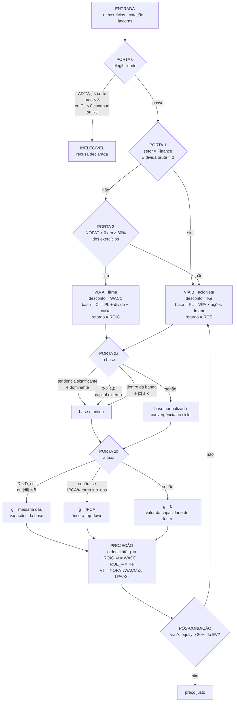

# Refinamento do motor de avaliação

**Status:** **homologada e implementada.** O orientador aprovou M1–M6 e P1–P13 em 05/09/2026,
e a arquitetura descrita aqui está em código desde 06/09/2026 — ver a §11.
**Data das medições:** 02–04/09/2026, contra a cascata real e dados de produção da brapi.
**Decisão que a governa:** [025 — reconstrução do motor de avaliação](decisoes/025-reconstrucao-do-motor-de-avaliacao.md),
que declara `postura: reconstrucao` sobre `packages/equisim_core/lib/src/services/valuation` e
`packages/equisim_core/lib/src/usecases/compute_valuation.dart`.

> **Como ler daqui em diante.** As seções 1 a 9 estão no tempo em que foram escritas — descrevem
> o defeito medido e a arquitetura proposta, e não foram reescritas para o passado. O que mudou é
> o *status*: nada aqui é mais proposta. A §10 registra o que foi homologado, e a §11 registra o
> que foi construído e o que a medição sobre o universo revelou depois.

Artefatos publicados que este documento consolida:

| Artefato | O que traz |
|---|---|
| [Onde o upside desanda](https://claude.ai/code/artifact/1fd00448-5fd9-453b-925f-58ef250ca68c) | Diagnóstico: os defeitos medidos na cascata atual |
| [Qual modelo para qual empresa](https://claude.ai/code/artifact/26286224-4a58-468a-b9bf-786d73dad9e7) | Roteamento por portas e vias, ativo a ativo |
| [Árvore de decisão do valuation](https://claude.ai/code/artifact/448dd522-7b23-4168-bd56-81bf874bcf07) | Árvore lógica, entra/sai de cena, parâmetros |
| [Parametrização estatística das portas](https://claude.ai/code/artifact/212f0aa3-f355-45db-b5f0-94a8d7f844a7) | Substituição dos limiares fixos por estatísticas |

---

## 1. Sumário — os defeitos medidos

Todos verificados por execução, não por leitura de código.

| # | Defeito | Evidência |
|---|---|---|
| D1 | Horizonte de convergência de 12 meses torna a anualização a identidade | `(1+upside)^(1/1)−1 = upside`. PETR4 com +209% de upside entra na média da carteira como 209% a.a. |
| D2 | FCFF cresce sem freio de reinvestimento; LPA tem freio | Decisão 24 corrigiu só o lado do acionista. Peso terminal: 63,5%–80,0% na via da firma contra 41,8%–63,9% na do acionista |
| D3 | Teto da perpetuidade virou valor modal | **8 de 8** ativos por FCFF ficaram exatamente em 8,15% |
| D4 | `realEconomyGrowth = 3%` é a única âncora chumbada | IBC-Br mede **1,45% a.a.** em 10 anos. Teto nominal cairia de 8,15% para 6,52% |
| D5 | Rótulo da fórmula 6 chama de "PIB" um número nominal | O painel exibe `g_eco = 8,15` com o texto "não cresce acima do PIB" |
| D6 | Série de LPA regredida é mistura de duas bases | BBAS3: EPS publicado até 2019, `lucro ÷ ações atuais` a partir de 2020, com bonificação em 2024. Regressão devolve **0,4%**; sobre o agregado, **6,7%** |
| D7 | Escolha do modelo pelo sinal do fluxo de um exercício | EGIE3 caiu para LPA por 2025 negativo, após 11 positivos em 16 |
| D8 | Queda de degrau silenciosa por `fairValuePerShare <= 0` | RENT3 sobreviveu por um centavo: preço justo de **R$ 0,12** contra R$ 36,36 |
| D9 | Teto de 20% do crescimento explícito virou valor modal | **8 de 18** estão exatamente em 20,0%; a PRIO3 devolveu 59,8% brutos |
| D10 | `_tryMultiples` usa o EV/EBITDA da própria empresa | Reconstrói o próprio preço: upside ≈ 0 por construção. O enum documenta "múltiplo setorial" |

Dispersão resultante do *upside* nos 18: de **−99,7%** (RENT3) a **+209,2%** (PETR4).

---

## 2. Arquitetura proposta

### 2.1 Árvore lógica



A **pós-condição** é a única aresta que volta: o teste da ponte de equity não pode ser
pré-filtro, porque depende do EV que só existe depois do desconto. Ver §5.3.

### 2.2 Árvore de decisão sobre o código

Onde cada ramo da árvore lógica toca o repositório.

```
packages/equisim_core/lib/src/
│
├── entities/fundamentals.dart
│     ENTRA  campo  sharesOutstandingHistorico          ← sem ele não há PL nem CI (D6)
│     ENTRA  getter investedCapital  = PL + totalDebt − totalCash
│     ENTRA  getter equityBookValue  = bookValuePerShare × sharesOutstandingHistorico
│     ENTRA  campo  nopat (de cleanNopat)               ← publicado em 16 dos 18
│
├── services/valuation/growth_estimator.dart
│     SAI    fromHistory()  regressão log-linear sobre fluxo   (D6, D9)
│     SAI    floorRate / ceilingRate  banda [−5%, +20%]        (D9)
│     SAI    realEconomyGrowth = 0.03                          (D4)
│     ENTRA  fundamentalGrowth()   mediana das variações da base
│     ENTRA  dispersionTest()      D = |g_med − g_reg| / se(ĝ)
│     ENTRA  trendTest()           t de Newey-West + ρ
│     ENTRA  comparabilityTest()   Φ = capital externo / base inicial
│     ENTRA  fundingTest()         IPCA / retorno ≤ retenção observada
│     ENTRA  perpetual()  passa a receber g_eco medido, não constante
│
├── services/valuation/base_flow.dart
│     SAI    winsorização do fluxo absoluto contra a mediana   (mistura ciclo e escala)
│     ENTRA  returnConvergence()  ret_t = atual + (ciclo − atual)·t/N
│
├── services/valuation/dcf.dart
│     ENTRA  fcff() passa a projetar NOPAT × (1 − RI)          (D2)
│     ENTRA  laço de projeção com decaimento de g até g_∞
│     ENTRA  terminal com ROIC_∞ = WACC / ROE_∞ = Ke           (neutraliza D3)
│     MUDA   minimumSpread deixa de ser assimétrico entre fcff e earningsPerShare
│
├── services/valuation/eligibility.dart                        ← ARQUIVO NOVO
│     ENTRA  Porta 0: ADTV, histórico mínimo, solvência
│
├── usecases/compute_valuation.dart
│     SAI    _earningsPerQuotedUnit como base de regressão     (D6)
│     SAI    escolha de via pelo sinal do FCF do exercício     (D7)
│     SAI    if (outcome.fairValuePerShare <= 0) return null   (D8)
│     ENTRA  roteamento explícito por Porta 1 e Porta 3
│     ENTRA  pós-condição da ponte de equity, com migração declarada
│     MUDA   _auditPerpetualGrowth: rotular g_eco como NOMINAL (D5)
│     PENDE  _tryMultiples: decidir se sai ou vira múltiplo setorial de fato (D10)
│
├── services/portfolio/expected_return.dart
│     MUDA   defaultHorizonMonths: 12 → a definir                (D1)
│
└── usecases/portfolio_usecases.dart
      ENTRA  ResolveMarketAnchors passa a medir PIB real e nominal

lib/data/
├── datasources/remote/brapi_datasource.dart
│     MUDA   fusão preserva sharesOutstanding do exercício em campo próprio
│     ENTRA  mapeia propertyPlantEquipment, totalCurrentAssets, currentLiabilities,
│            realizedShareCapital, profitReserves, cleanNopat
└── dtos/brapi_dtos.dart
      ENTRA  os campos acima no BrapiFundamentalsDto
```

---

## 3. Especificação das portas

### 3.0 Porta 0 — elegibilidade e integridade contábil

**Por que existe.** Todos os parâmetros foram calibrados nos 18 ativos, cujo ADTV vai de
R$ 36,6 mi (AZZA3) a R$ 1.541,9 mi (PETR4). A mediana do universo negociável é **R$ 9,2 mi**
e o primeiro quartil, R$ 1,9 mi. A amostra está inteira no decil superior de liquidez, e a
Porta 0 existe para tornar essa fronteira explícita em vez de extrapolá-la em silêncio.

#### 3.0.a Liquidez

```
ADTV₉₀ = mediana{ P_t × V_t }  sobre os 90 pregões anteriores a t₀
```

Mediana e não média: um leilão de bloco isolado distorce a média e é exatamente o caso a
excluir. O critério protege três insumos — beta, Ke e WACC —, porque pregão sem formação de
preço gera retorno zero espúrio e **enviesa o beta para baixo** (β̂ → β(1−θ) sob não-negociação
com fração θ), reduzindo o desconto e inflando o preço justo. É o pior sentido de erro.

| Corte | Ativos elegíveis | Leitura |
|---|---:|---|
| ≥ R$ 0,5 mi | 194 | quase todo o negociável |
| ≥ R$ 1,0 mi | 182 | exclui o que não forma preço diário |
| **≥ R$ 2,0 mi** | **161** | **sugerido** |
| ≥ R$ 5,0 mi | 132 | conservador |
| ≥ R$ 20,0 mi | 85 | perde metade do analisável |

> **Medição contra a intuição:** nenhum dos 215 papéis com trimestre completo teve pregão de
> volume zero, nem abaixo de R$ 1 mi de ADTV. A atenuação por não-negociação **não é o risco
> dominante nesta bolsa**; o risco que resta é de impacto, preço formado por poucos negócios.

Universo: 786 tickers `type=stock`, dos quais 404 são classes fracionárias (sufixo `F`),
restando **382 papéis-base** e 372 com capitalização publicada.

#### 3.0.b Histórico mínimo

O piso sai do teste que a Guarda 1 executará. Numa regressão simples há `n − 2` graus de
liberdade, e o R² crítico cresce rápido quando `n` encolhe:

```
n =  6  →  R²_crit(10%) = 0,53      n = 10  →  0,30
n =  8  →  0,39                     n = 12  →  0,25
n =  9  →  0,34                     n = 16  →  0,18
```

Com `n = 6`, só uma tendência que explique 53% da variância é detectável: abaixo disso o teste
não tem poder, nunca rejeita, e a guarda vira decoração.

**Piso: `n ≥ 8` exercícios completos.** Seis graus de liberdade, e o mínimo em que a janela de
ciclo de 8 anos ainda existe. O marco de 2010 (convergência às normas internacionais) dá o
teto de 16, então a faixa operacional é `8 ≤ n ≤ 16`.

#### 3.0.c Solvência e continuidade

```
PL ≤ 0 em ≥ 2 exercícios consecutivos, incluindo o mais recente
    → INELEGÍVEL. Sem base de capital não há ROE, ROIC, retenção
      nem crescimento fundamental.

PL ≤ 0 apenas no exercício mais recente
    → elegível, com base normalizada obrigatória e declarada.

Recuperação judicial ou extrajudicial deferida
    → INELEGÍVEL enquanto durar. A continuidade está formalmente
      suspensa; o equity é opção sobre os ativos, não fluxo descontado.
```

> **Limitação sem solução automática:** a fonte não publica situação de recuperação judicial.
> O campo `isActive` marca negociabilidade, não continuidade — os 786 tickers vêm todos com
> `isActive = true`. Este critério depende de **lista externa declarada na metodologia**.

---

### 3.1 Porta 1 — de quem é o fluxo

```
setor da fonte == "Finance"   E   dívida bruta == 0
    → VIA B (acionista), Ke, sem ponte de dívida líquida
```

**Os dois sinais são exigidos juntos.** A fonte classifica a **RENT3** como `Finance`
(subsetor "Aluguel de Carros"); só o setor a rotearia errado, e a dívida de R$ 43,6 bi é o que
a desqualifica. Nos 18, os dois critérios juntos selecionam exatamente BBAS3, BBSE3 e BPAC11.

**Confirmação independente:** BBAS3 e BPAC11 **não têm EBIT em nenhum dos 16 exercícios** — a
fonte não o publica para banco, o que fecha numericamente a impossibilidade da via da firma.

**Por que.** Num banco, depósito e captação são o insumo do negócio de crédito, não a forma de
financiá-lo. Três consequências: a ponte de equity somaria o caixa do banco ao acionista
(BBAS3 tem dívida bruta zero contra R$ 59,6 bi de caixa, ou seja, dívida líquida de
**−R$ 59,6 bi**); o WACC não é definível sem estrutura D/E; e o reinvestimento não é mensurável
porque não há capex nem capital de giro no sentido industrial.

---

### 3.2 Porta 3 — o fluxo da firma sustenta perpetuidade

```
NOPAT > 0 em ≥ 60% dos exercícios da janela
    → VIA A.   Caso contrário → VIA B.
```

**Por que NOPAT e não fluxo livre.** O fluxo livre de manutenção é, por definição:

```
FCF_manutenção = NOPAT + D&A − CapEx_manutenção
```

e a aproximação padrão para empresa madura é `CapEx_manutenção ≈ D&A` — manter a base
instalada custa repor a depreciação. Substituindo:

```
FCF_manutenção ≈ NOPAT
```

**O teste não precisa de CapEx**, que a fonte não publica. E `cleanNopat` vem pronto em 16 dos
18 ativos (ausente só nos dois bancos, que já saíram pela Porta 1 — a implementação precisa de
guarda para NOPAT nulo, ainda que ela nunca deva ser alcançada).

| Ativo | FCF > 0 | NOPAT > 0 | Por FCF | Por NOPAT |
|---|---:|---:|---|---|
| RENT3 | 38% | 100% | via B | **via A** |
| EQTL3 | 38% | 100% | via B | **via A** |
| PRIO3 | 25% | 69% | via B | **via A** |
| SLCE3 | 62% | 100% | via A, limítrofe | via A, com folga |
| EGIE3 | 69% | 100% | via A | via A |
| VALE3 | 94% | 94% | via A | via A |

Isso corrige D7: o fluxo livre negativo por ciclo de investimento deixa de ser lido como
fragilidade.

> **Consequência de roteamento.** Sob a métrica de NOPAT, **RENT3, EQTL3 e PRIO3 migram para a
> via A** — as três eram via B sob o critério de fluxo livre bruto. A via B passa a conter
> **apenas os três ativos que a Porta 1 seleciona** (BBAS3, BBSE3, BPAC11), e a base de
> avaliação delas muda de patrimônio líquido para capital investido, o que altera retorno,
> retenção e crescimento. As três permanecem sujeitas à pós-condição da ponte de equity (§5.3),
> que é justamente o teste que a RENT3 tende a reprovar.

---

### 3.3 Porta 2 — duas saídas independentes

A porta não classifica a empresa: atribui tratamento. Uma saída decide o **nível** do fluxo,
outra a **taxa**.

#### Saída 1 — a base

Normalizador é o **retorno sobre a base de capital** (ROIC na via A, ROE na via B), não a
margem. Três razões: é a grandeza que aparece em `g = retorno × retenção` e no valor terminal,
mantendo consistência interna; funciona sem receita, que a BBSE3 não tem; e é a mesma medida
nas duas vias.

```
retorno_t = retorno_atual + (retorno_ciclo − retorno_atual) × t/N
```

Convergência, não salto — simétrica por construção, sem trava assimétrica de topo. O ciclo é a
**mediana de 8 anos**.

**Três guardas em série:**

```
G1  tendência        t_HAC significante (α=10%, série completa)  E  ρ ≥ 1  → não normaliza
G2  comparabilidade  Φ = capital externo / base inicial > 1,0            → não normaliza
G3  banda            |z| > 1,5  OU  razão fora de [0,75; 1,33]           → normaliza
```

com

```
ρ = |β̂₁| · H / |retorno_atual − mediana_ciclo|          deriva contra reversão
Φ = Σ_t max(0, ΔPL_t − lucro_t) / base_{t−H}            capital externo acumulado
z = (retorno_atual − mediana) / (1,4826 · MAD)          desvio robusto
```

#### Saída 2 — a taxa

```
0. se se(ĝ) > σ_max
       → não identificável por IMPRECISÃO, vai para 2

1. se D ≤ D_crit  OU  |g_med − g_reg| ≤ δ
       → g = mediana das variações da base            (fundamental)

2. senão, se IPCA / retorno_ciclo ≤ retenção observada
       → g = IPCA                                     (âncora top-down)

3. senão
       → g = 0                                        (valor da capacidade de lucro)
```

com

```
se(ĝ) = (1 + ĝ) · S_yx / √S_xx           precisão do estimador paramétrico
σ_max = 3 p.p.

D      = |g_mediana − g_regressão| / se(ĝ_regressão)
D_crit = t_{n−2, 1−α/2}
δ      = max(2 p.p. ,  0,25 · |g_mediana|)
```

**A perna 0 existe por um ponto cego medido.** O teste `D` detecta *discordância*, não
*imprecisão*: dois estimadores podem concordar porque ambos são ruins. A PRIO3 tem
`D = 0,91` — abaixo de qualquer limiar, portanto "identificável" — com `se(ĝ) = 9,9 p.p.` e
intervalo de confiança de 90% em **[16,9%; 51,9%]**. Sem a perna 0 ela receberia crescimento
fundamental de 25,4%. Ver §6.5.

O teste de financiabilidade é a **mesma identidade** que sustenta a via B — o modelo se
confere em vez de precisar de lista de exceções. E ele discrimina de verdade: a AZZA3 precisa
reter 24,3% e retém 69,3%, passa; a VIVT3 precisaria reter **73,3%** e retém 7,9%, reprova.

---

## 4. As duas vias

A simetria é o ponto. A decisão 24 corrigiu a dupla contagem no lado do acionista e não tocou
no da firma; a especificação aplica a mesma correção nos dois.

| | **Via A · firma** | **Via B · acionista** |
|---|---|---|
| Base de capital | `CI = PL + dívida bruta − caixa` | `PL = VPA × ações do exercício` |
| Retorno | `ROIC = NOPAT / CI₀` | `ROE = lucro / PL₀` |
| Reinvestimento | `RI = ΔCI / NOPAT` | `b = ΔPL / lucro`, em `[0,1]` |
| Crescimento | `g = ROIC × RI = ΔCI / CI₀` | `g = ROE × b = ΔPL / PL₀` |
| Fluxo projetado | `NOPAT_t × (1 − RI)` | `LPA_t × (1 − b)` |
| Desconto | WACC | Ke |
| Ponte | `P₀ = (EV − dívida líquida) / N` | direto, sem ponte |

### Deduções

**Via A.** O lucro operacional do ano seguinte é o deste ano mais o retorno do capital novo:

```
NOPAT₁ = NOPAT₀ + ΔCI × ROIC
g = ΔNOPAT/NOPAT₀ = (ΔCI/NOPAT₀) × ROIC = RI × ROIC
```

E `FCFF = NOPAT − reinvestimento = NOPAT × (1 − RI)`. As três grandezas **não são
independentes**: fixadas duas, a terceira está determinada. É aí que o modelo atual erra — fixa
`g` por regressão e depois faz o FCFF crescer sem descontar o reinvestimento que o produz.

**Via B.** O patrimônio cresce pelo lucro que não sai:

```
ΔPL = lucro × b   ⟹   g = ΔPL/PL₀ = (lucro/PL₀) × b = ROE × b
```

E `LPA × (1 − b)` **é** o dividendo, porque `1 − b` é o *payout*. **A via B é um DDM** — mas
obtém o dividendo pela identidade da retenção em vez de dado publicado de provento, o que a
mantém compatível com a decisão 23: não reabre `DividendRepository`, não reintroduz a premissa
de base bruta, não credita provento a retorno nenhum.

### A dispensa do CapEx

A expressão `(CapEx − Depreciação + ΔNKG) / NOPAT` **não é aproximação** de `ΔCI / NOPAT`: é a
mesma coisa em componentes.

```
lado operacional       CI = imobilizado + intangível + NKG
lado do financiamento  CI = PL + dívida − caixa

(CapEx − Dep) + ΔNKG = Δ(imobilizado) + ΔNKG = ΔCI = Δ(PL + dívida − caixa)
```

Medi as duas rotas: **concordam dentro de 3 p.p. em sete dos nove** ativos testados — VALE3
0,2; WEGE3 0,6; KLBN11 0,7; PETR4 2,8; ABEV3 2,8; SAPR11 3,0; SLCE3 3,2. Divergem em PRIO3
(7,6) e EQTL3 (11,5), que a Porta 2 já reprova por outro motivo. **Ter as duas rotas dá um
teste de qualidade de graça.**

Reconstruir o CapEx isolado seria frágil e não é preciso: `Δ(imobilizado) + D&A` dá **negativo**
para a VALE3 em 2023 e R$ 165 bi para a PETR4 em 2025 contra R$ 86 bi de `investmentCashFlow`
— o imobilizado líquido se move por *impairment*, câmbio e reavaliação. E o
`investmentCashFlow` como proxy erra por fatores de **0,25× a 2,42×**, para os dois lados.

---

## 5. Tratamento comum

### 5.1 Decaimento

```
g_t = g − (g − g_∞) × (t − 1)/(N − 1)
```

Hoje o crescimento é constante por 5 anos e despenca no ano 6. Vantagem competitiva não termina
numa data: ela se desgasta conforme a concorrência entra.

### 5.2 Terminal com reversão do retorno

```
g_∞ = min(g, g_eco)          g_eco = PIB nominal medido
ROIC_∞ = WACC                ROE_∞ = Ke
```

**Consequência algébrica que resolve D3 e D5 estruturalmente:**

```
VT = FCFF_{N+1} / (WACC − g)      com  FCFF_{N+1} = NOPAT_{N+1} × (1 − g/ROIC)

com ROIC = WACC:
    FCFF_{N+1} = NOPAT_{N+1} × (WACC − g)/WACC

    VT = NOPAT_{N+1} × (WACC − g) / [ WACC × (WACC − g) ]

    VT = NOPAT_{N+1} / WACC          ← g desaparece
```

O mesmo do lado do acionista: com `ROE_∞ = Ke`, o terminal vira `LPA_{N+1} / Ke`. **O valor
terminal deixa de depender de `g_∞`** — a premissa dos 8% deixa de mover o resultado justamente
na parte que hoje carrega 63% a 80% do valor. O teto `g_∞ ≤ g_eco` permanece como banda de
sanidade, mas sai do papel de premissa determinante.

### 5.3 Pós-condição da ponte de equity

```
via A:  se (EV − dívida líquida) < 0,20 × EV
            → descartar o resultado, migrar para a via B, DECLARAR a migração
```

**Não pode ser pré-filtro.** Testei com valor de mercado como proxy: a RENT3 tem
`equity/EV = 54%`, estrutura perfeitamente normal. O preço justo de R$ 0,12 não vem de
alavancagem alta — vem de o EV do modelo (≈ R$ 33 bi) ser metade do EV de mercado (R$ 72 bi).
A ponte fica fina porque a avaliação é baixa, não porque a dívida é alta. **Logo o teste só
existe depois do desconto.**

Isso não o invalida; muda onde mora. É exatamente o que hoje acontece em silêncio no
`fairValuePerShare <= 0`: a correção é tornar o critério gradual e o efeito visível.

**Justificativa de propagação de erro.** Em `P₀ = (EV − D)/N`, quando `D → EV` o numerador é a
diferença de dois números grandes e quase iguais, e o erro relativo é amplificado por
`EV/(EV − D)`:

```
RENT3:  EV ≈ 33,2 bi   D = 33,0 bi   equity ≈ 0,24 bi
        fator de amplificação = 138×
        erro de 1% em EV → erro de ~138% no preço justo
```

---

## 6. Parametrização estatística

### 6.1 R² crítico (substitui `R² ≥ 0,35`)

Para `r_t = β₀ + β₁ t + ε_t`, a estatística F do teste `H₀: β₁ = 0` em função do R² amostral:

```
F = [ R²/(1 − R²) ] · (n − 2)  ~  F(1, n−2)     e como há um só regressor, F = t²

Rejeitar ao nível α  ⟺  [R²/(1−R²)]·(n−2) ≥ t²_{n−2, 1−α/2}

        R²_crit(n, α) = t²_{n−2,1−α/2} / ( t²_{n−2,1−α/2} + n − 2 )
```

| n | g.l. | t (5%) | R²_crit 5% | R²_crit 10% | Contra o 0,35 fixo |
|---:|---:|---:|---:|---:|---|
| 6 | 4 | 2,776 | 0,658 | 0,532 | laxo — aceita ruído |
| 8 | 6 | 2,447 | 0,499 | 0,386 | laxo |
| 10 | 8 | 2,306 | 0,399 | 0,302 | laxo |
| 12 | 10 | 2,228 | 0,332 | 0,247 | coincide |
| 14 | 12 | 2,179 | 0,283 | 0,209 | estrito — descarta real |
| 16 | 14 | 2,145 | 0,247 | 0,181 | estrito |

Quantis por inversão da beta incompleta, conferidos contra tabela
(`t(14; 0,975) = 2,1448`, `t(6; 0,975) = 2,4469`).

### 6.2 Newey-West, e por que não em n = 8

```
V̂_HAC(β̂₁) = S_xx⁻¹ · Ω̂ · S_xx⁻¹ ,     S_xx = Σ x_t²,  x_t = t − t̄

Ω̂ = Σ_t x_t² ê_t² + 2 Σ_{j=1}^{L} w_j Σ_{t=j+1}^{n} x_t ê_t x_{t−j} ê_{t−j}

w_j = 1 − j/(L+1)              núcleo de Bartlett, garante Ω̂ ≥ 0
L   = ⌊ 4 (n/100)^{2/9} ⌋      regra de banda
Ω̂  ← Ω̂ · n/(n−2)              correção de amostra pequena
```

> **Achado que deve entrar na metodologia.** Na janela de 8 anos o HAC não corrigiu para baixo:
> corrigiu **para cima**, e violentamente — SAPR11 de `t = −2,63` para `−4,76`; AZZA3 de `−2,99`
> para `−6,45`; RADL3 de `2,19` para `4,45`. Não é autocorrelação negativa: é o estimador
> colapsando com `L = 2` sobre 8 pontos, montando Ω̂ a partir de somas de 6 e 7 termos. O
> estimador é **consistente, não centrado**, e n = 8 não é assintótico.
>
> Na série completa (n = 10 a 15) o quadro se estabiliza e o HAC corrige pouco: WEGE3
> `5,91 → 6,09`, PETR4 `2,86 → 2,95`, RENT3 `−3,25 → −2,84`. **O teste de tendência deve rodar
> sobre a série completa**, não sobre a janela de 8 anos usada para a mediana do ciclo.
>
> Consequência medida: a **EQTL3 perde a tendência** — β̂₁ passa de −3,53 p.p./ano na janela
> curta para −0,06 na série completa. Era artefato de janela.

### 6.3 Inclinação relativa (substitui `|β̂₁| > 1 p.p./ano`)

```
Δ_tend = |β̂₁| · H          deriva no horizonte de projeção
Δ_rev  = |r_t − mediana|   correção por reversão

              ρ = Δ_tend / Δ_rev

tendência domina  ⟺  β̂₁ significante por t_HAC  E  ρ ≥ 1
```

Adimensional, invariante à escala do retorno, sem constante arbitrada. **A trava de 1 p.p./ano
era o defeito maior**, não o R²: descartava EGIE3 (t = −3,06), RADL3 (t = 4,88) e SAPR11 na
janela curta (t = −4,76) por inclinação pequena em valor absoluto.

### 6.4 Desvio robusto (complementa a banda)

```
σ̂_rob = 1,4826 · mediana{ |r_i − mediana(r)| }        MAD escalado
z_t   = ( r_t − mediana(r) ) / σ̂_rob
```

O fator `1,4826 = 1/Φ⁻¹(0,75)` torna o MAD consistente com σ sob normalidade. Usa-se MAD e não
desvio-padrão porque o ponto de ruptura do desvio é `1/n` — o próprio exercício atípico que se
quer detectar infla o denominador e se esconde. O MAD tem ponto de ruptura 50%.

**União, não substituição.** Banda e Z discordam em **9 dos 18**, nos dois sentidos:

| Ativo | σ̂_rob | Razão | \|z\| | Divergência |
|---|---:|---:|---:|---|
| PRIO3 | 36,6p | 0,18 | 1,05 | banda normaliza, Z não |
| EQTL3 | 12,5p | 0,37 | 1,13 | banda normaliza, Z não |
| VALE3 | 6,5p | 0,46 | 1,38 | banda normaliza, Z não |
| VIVT3 | **0,7p** | 1,27 | **2,27** | Z normaliza, banda não |
| SAPR11 | **1,3p** | 0,83 | 1,58 | Z normaliza, banda não |
| RADL3 | **1,4p** | 1,12 | 1,58 | Z normaliza, banda não |

O **Z mede raridade**; a **razão mede materialidade**. Como o valor da perpetuidade é
*proporcional* à base, a razão é a medida economicamente correta do impacto. Sob Z puro com
k = 1,5 a **VALE3 deixaria de ser normalizada** (|z| = 1,38) — e ela é o ciclo mais limpo da
amostra. O custo de falso positivo é baixo porque a normalização é **convergente, não salto**.

### 6.5 Dispersão padronizada (substitui `5 p.p.`)

```
S_yx   = √( Σ ê² / (n−2) )              erro-padrão da regressão
se(β̂₁) = S_yx / √S_xx

ĝ = e^{β̂₁} − 1  ⟹  pelo método delta:  se(ĝ) = (1 + ĝ) · se(β̂₁)

        D = | g_mediana − g_regressão | / se(ĝ_regressão)
```

O caso BBSE3 deixa de ser decidido por frações decimais: 4,8 p.p. contra limiar de 5,0 vira
**D = 3,91** contra `D_crit = 1,78`.

> **Armadilha 1 — significância sem materialidade.** O teste puro sinaliza 11 dos 18: o BBAS3
> tem `D = 6,69` sobre diferença de apenas 1,9 p.p., porque `se(ĝ) = 0,3 p.p.` Detecta
> diferenças estatisticamente reais e economicamente irrelevantes. Daí a exigência conjunta
> com `δ = max(2 p.p., 0,25·|g_med|)`.

> **Armadilha 2 — o ponto cego da concordância.** `D` é uma razão, e cresce quando o
> denominador encolhe. Simetricamente, **encolhe quando o denominador explode**: dois
> estimadores ruins concordam por construção. Medindo `se(ĝ)` nos 18, a distribuição é
> 0,3 · 0,6 · 0,6 · 0,6 · 0,7 · 0,7 · 0,7 · 0,9 · 1,2 · 1,2 · 1,2 · 1,2 · 1,4 · 1,9 · 2,0 ·
> 2,3 · 3,0 · **9,9** p.p. A PRIO3 é um ponto isolado, com o dobro da imprecisão do segundo
> colocado, e passaria no teste `D` com folga (0,91 contra 1,77):
>
> ```
> PRIO3   ĝ = 25,4%   se(ĝ) = 9,9 p.p.   IC 90% = [16,9% ; 51,9%]   D = 0,91
> ```
>
> Um intervalo de 35 pontos percentuais de largura não é estimativa. **A perna de precisão
> (`se(ĝ) > σ_max`) é o que impede o teste de dispersão de aprovar por ignorância**, e com
> `σ_max = 3 p.p.` ela isola exatamente a PRIO3 — a AZZA3, em 3,0 p.p., já é barrada pela
> discordância.

### 6.6 Comparabilidade orgânica (substitui `3× em 8 anos`)

Da relação de excedente limpo `ΔPL_t = lucro_t − dividendos_t + emissão_t + OCI_t`, e sem dado
de provento, a parcela externa se limita por baixo por:

```
externo_t = max( 0 , ΔPL_t − lucro_t )

Φ = ( Σ_t externo_t ) / base_{t−H}

Φ ≤ 0,35  → orgânica       Φ > 1,0  → inorgânica, base incomparável
```

> **Por que não `Δ capital social`.** Foi minha primeira formulação e **falha**: o capital
> social sobe tanto por emissão primária quanto por incorporação de reservas (bonificação), que
> não traz dinheiro novo. A WEGE3 acusa R$ 9,0 bi de aumento sobre base de R$ 6,3 bi e seria
> classificada como inorgânica; abrindo por exercício, R$ 2,0 bi em 2018 vieram com reservas
> caindo R$ 1,5 bi, e R$ 5,0 bi em 2025 com reservas caindo R$ 8,9 bi — **as duas maiores altas
> são reclassificação contábil**. O estimador por `ΔPL − lucro` é imune, porque bonificação não
> altera o patrimônio.

| Ativo | Mult 8a | Φ | Critério 3× | Critério Φ | Leitura |
|---|---:|---:|---|---|---|
| EGIE3 | 3,36× | 0,58 | barra | **libera** | a crítica procede |
| WEGE3 | 2,51× | 0,24 | libera | libera | o critério por capital social erraria |
| RADL3 | 2,97× | 0,11 | libera por pouco | libera | orgânica pura |
| BBAS3 | 2,15× | 0,06 | libera | libera | R$ 120,5 bi de lucro contra R$ 5,1 bi externos |
| **TOTS3** | 3,55× | **1,13** | barra | **barra** | **refuta a hipótese de crescimento orgânico** |
| EQTL3 | 4,93× | 1,26 | barra | barra | R$ 7,2 bi externos sobre base de R$ 5,7 bi |
| PRIO3 | 29,96× | 5,50 | barra | barra | confirmado |
| RENT3 | 9,82× | 6,02 | barra | barra | R$ 15,7 bi externos contra R$ 11,9 bi de lucro |
| AZZA3 | 19,00× | 12,67 | barra | barra | fusão |

---

## 7. Resultado nos 18, com todos os parâmetros novos

Via, base e retorno já refletem o roteamento por NOPAT: **a via B contém apenas os três ativos
da Porta 1**, e os demais são avaliados sobre capital investido.

| Ativo | Via | Φ | \|z\| | Razão | Base | se(ĝ) | Origem da taxa | g |
|---|---|---:|---:|---:|---|---:|---|---:|
| BBAS3 | B | 0,06 | 1,41 | 0,63 | **normaliza 1,60×** | 0,3p | fundamental | 10,5% |
| BBSE3 | B | 0,00 | 0,56 | 1,19 | mantida | 1,2p | **âncora IPCA** | 5,0% |
| BPAC11 | B | 0,59 | 1,57 | 1,25 | **normaliza 0,80×** | 1,2p | fundamental | 18,9% |
| RENT3 | A | 5,87 | 0,73 | 0,70 | mantida | 2,3p | âncora IPCA | 5,0% |
| EQTL3 | A | 4,76 | 2,18 | 0,52 | mantida | 1,2p | âncora IPCA | 5,0% |
| PRIO3 | A | 86,10 | 1,26 | 0,10 | mantida | **9,9p** | âncora IPCA | 5,0% |
| EGIE3 | A | 0,58 | 3,44 | 0,63 | **normaliza 1,59×** | 1,2p | fundamental | 15,8% |
| SLCE3 | A | 0,79 | 0,85 | 1,22 | mantida | 0,9p | fundamental | 8,9% |
| PETR4 | A | 0,02 | 0,14 | 1,13 | mantida | 0,6p | fundamental | 3,8% |
| VALE3 | A | 0,00 | 1,38 | 0,46 | **normaliza 2,18×** | 0,6p | fundamental | 3,3% |
| SAPR11 | A | 0,08 | 1,58 | 0,83 | **normaliza 1,21×** | 0,7p | fundamental | 10,0% |
| ABEV3 | A | 0,00 | 0,16 | 1,03 | mantida | 0,6p | fundamental | 9,1% |
| KLBN11 | A | 0,29 | 1,49 | 0,76 | mantida | 0,7p | fundamental | 10,2% |
| WEGE3 | A | 0,24 | 0,27 | 1,12 | mantida | 0,7p | fundamental | 10,8% |
| RADL3 | A | 0,11 | 1,58 | 1,12 | mantida | 1,9p | fundamental | 14,4% |
| VIVT3 | A | 0,03 | 2,27 | 1,27 | **normaliza 0,79×** | 2,0p | **g = 0** | 0,0% |
| TOTS3 | A | 1,13 | 0,20 | 1,06 | mantida | 1,4p | âncora IPCA | 5,0% |
| AZZA3 | A | 12,67 | 1,49 | 0,40 | mantida | 3,0p | âncora IPCA | 5,0% |

**Distribuição:** via A 15/18 · via B 3/18 · fundamental 11/18 · âncora IPCA 6/18 ·
`g = 0` 1/18 · base normalizada 6/18.

Quatro leituras que validam o desenho:

1. **A BBSE3 cai na âncora por construção**, não por ajuste. Com a dispersão padronizada
   (D = 3,91 contra D_crit = 1,78) e a materialidade (4,8 p.p. > 1,85 p.p.), ela sai do
   fundamental; com a financiabilidade aprovada, recebe a inflação. É exatamente o resultado
   que a discussão anterior alcançara por raciocínio.
2. **A EGIE3 volta a ser normalizável** — Φ = 0,58 passa na comparabilidade nova, e z = 3,44
   dispara a banda. A crítica de que a trava de 3× penalizava compostora orgânica procede.
3. **A PRIO3 só não recebe 25,4% de crescimento por causa da perna de precisão.** Na via A ela
   passa no teste de discordância (D = 0,91), e é o piso `se(ĝ) ≤ 3 p.p.` que a manda para a
   âncora. Sem ele, o ativo mais imprecisamente medido da amostra receberia o maior crescimento.
4. **Só a VIVT3 fica com `g = 0`**, e não é arbitrário: o crescimento fundamental medido dela é
   0,7% e ela reprova na financiabilidade. Duas rotas independentes concordam.

---

## 8. Limitações de dado

Restrições da fonte, não escolhas. Precisam constar na metodologia.

| Limitação | Consequência |
|---|---|
| **A brapi não publica CapEx** — o DFC tem 17 campos e nenhum é imobilizado | Contornável por `ΔCI`, mas impede reportar CapEx e depreciação separadamente |
| **BBSE3 vem com `totalRevenue` zerado nos 14 exercícios** | Exclui a seguradora de normalização por margem e de qualquer elasticidade ao PIB — é o motivo de o normalizador ser retorno sobre capital |
| **BBAS3 e BPAC11 não têm EBIT em nenhum dos 16 exercícios** | Confirma a Porta 1 e impede qualquer conta de firma para eles |
| **Granularidade só anual, no máximo 16 exercícios** | **Nenhum teste aqui tem poder estatístico**; os limiares são de triagem, não de inferência |
| **A elasticidade da receita ao PIB não é estimável** | R² entre 0,00 e 0,65 nos 18, maioria abaixo de 0,20. O fator da âncora precisa ser declarado, não medido |
| **Falhas pontuais na fonte** | `bookValue` da ABEV3 em 2012 vem R$ 0,062 contra R$ 2,81 no ano seguinte; do BBAS3 em 2023 vem nulo. O filtro tem de ser **por vizinhança**, não por mediana global — esta corta anos legítimos de empresa que cresceu ordens de magnitude |
| **Recuperação judicial não é observável** | O critério de continuidade depende de lista externa |
| **A amostra não representa o universo** | ADTV mínimo de R$ 36,6 mi contra mediana de R$ 9,2 mi. Toda constante foi estimada nas condições em que qualquer método funciona |

---

## 9. Fundamentação teórica

> Capítulos citados **pelo nome**, sem número e sem página: edições renumeram e repaginam, e
> uma referência precisa e errada é pior numa monografia que uma genérica e correta. Confira
> cada uma contra o exemplar que for citado.

### Porta 0 — elegibilidade

- **DAMODARAN**, *Investment Valuation* — "Estimating Risk Parameters and Costs of Financing".
  O viés do beta por negociação não sincronizada e o requisito de liquidez para estimá-lo.
- **GREENE**, *Econometric Analysis* — capítulos sobre inferência em regressão. Graus de
  liberdade e o poder do teste como piso do histórico mínimo.
- **DAMODARAN**, *The Dark Side of Valuation* — capítulos sobre empresas em dificuldade.
  A suspensão da premissa de continuidade.

### Porta 1 — instituição financeira

- **DAMODARAN**, *Investment Valuation* — "Valuing Financial Service Firms". Dívida como
  matéria-prima, capex e capital de giro não mensuráveis, avaliação direta do equity.
- **KOLLER, GOEDHART & WESSELS**, *Valuation* — "Valuing Banks". O valor vem do *spread* dos
  dois lados do balanço, o que impede tratar o passivo como financiamento.
- **SAUNDERS & CORNETT**, *Financial Institutions Management* — capítulos sobre adequação de
  capital. A restrição prudencial que faz `g = ROE × b` ser descrição estrutural.

### Porta 2a — normalização da base

- **KOLLER, GOEDHART & WESSELS**, *Valuation* — "Reorganizing the Financial Statements" e os
  capítulos sobre ROIC. Capital investido pelos dois lados do balanço; reversão do ROIC à média.
- **DAMODARAN**, *Investment Valuation* — "Estimating Cash Flows". Normalização do exercício
  base como pré-requisito, não refinamento.
- **HUBER & RONCHETTI**, *Robust Statistics* — capítulos sobre ponto de ruptura e estimadores
  de escala. O MAD, o fator 1,4826, e por que não usar σ amostral com outliers presentes.
- **TUKEY**, *Exploratory Data Analysis* — resumos de cinco números e cercas. A alternativa IQR.
- **HAMILTON**, *Time Series Analysis* — processos com tendência determinística e mudança
  estrutural. Reversão à média pressupõe estacionariedade: base formal da guarda de tendência.

### Porta 2b — a taxa

- **HIGGINS**, *Analysis for Financial Management* — "Managing Growth". A taxa de crescimento
  sustentável, que o teste de financiabilidade aplica.
- **GREENE**, *Econometric Analysis* — análise de especificação. Dois estimadores consistentes
  do mesmo parâmetro sob H₀, na linhagem de Hausman; e a identidade `F = t²`.
- **WOOLDRIDGE**, *Introductory Econometrics* — significância econômica versus estatística.
  Fundamentação direta do par `D + δ`.
- **NEWEY & WEST** (1987), retomado em **GREENE** — matrizes robustas a heterocedasticidade e
  autocorrelação. Núcleo de Bartlett e regra de banda.
- **LEAMER**, *Specification Searches* — escolher modelo a partir dos dados e reportar como se
  fosse dado. A razão de declarar em vez de escolher o estimador favorável.
- **GREENWALD, KAHN, SONKIN & VAN BIEMA**, *Value Investing* — *earnings power value*. A
  avaliação que não depende de previsão, como último recurso.
- **GRAHAM & DODD**, *Security Analysis* — separação entre poder de lucro corrente e valor
  atribuído ao crescimento.
- **LEV**, *Intangibles*; **PENMAN**, *Financial Statement Analysis and Security Valuation* —
  análise de rentabilidade e de crescimento. Por que o retorno contábil se distorce quando o
  ativo produtivo está fora do balanço.

### Porta 3 e a ponte

- **DAMODARAN**, *Investment Valuation* — "Estimating Cash Flows". Capex de manutenção contra
  de crescimento; FCFF negativo por expansão não é fragilidade.
- **KOLLER, GOEDHART & WESSELS**, *Valuation* — "Estimating Continuing Value". Estado
  estacionário como pré-requisito; e a demonstração de que com ROIC = WACC o crescimento não
  cria valor.
- **HIGHAM**, *Accuracy and Stability of Numerical Algorithms* — aritmética de ponto flutuante
  e somatórios. Cancelamento catastrófico; `EV/(EV − D)` é o número de condição da ponte.
- **HULL**, *Options, Futures, and Other Derivatives* — capítulo sobre risco de crédito. O
  modelo estrutural de Merton: equity alavancado como opção sobre os ativos.

### Vias e terminal

- **KOLLER, GOEDHART & WESSELS**, *Valuation* — "Frameworks for Valuation" e os capítulos sobre
  geradores de valor. A fórmula `V = NOPLAT(1 − g/ROIC)/(WACC − g)` é a especificação adotada.
- **DAMODARAN**, *Investment Valuation* — "Estimating Growth". Crescimento como *taxa de
  reinvestimento × retorno sobre o capital*, com consistência interna exigida.
- **RAPPAPORT**, *Creating Shareholder Value* — formulação anterior em geradores de valor.
- **GORDON**, *The Investment, Financing, and Valuation of the Corporation*; **WILLIAMS**,
  *The Theory of Investment Value* — a perpetuidade e a origem do desconto de dividendos.
- **PENMAN**, *Financial Statement Analysis and Security Valuation* — contabilidade de
  competência e a relação de excedente limpo. Autoriza medir retenção pela variação do
  patrimônio, e é o que mantém a via B compatível com a decisão 23.
- **PORTER**, *Competitive Strategy* — análise estrutural de indústrias. A economia da erosão
  do retorno excedente.
- **RAPPAPORT & MAUBOUSSIN**, *Expectations Investing* — período de vantagem competitiva.
- **FISHER**, *The Theory of Interest* — consistência entre nominal, real e inflação.

---

## 10. O que foi decidido

Homologado pelo orientador em **05/09/2026**. As colunas de opções e impacto ficam como
registro do que se pesava na hora; a coluna **Homologado** é o que valeu.

### 10.1 Decisões de método

| # | Decisão | Opções | Impacto | **Homologado** |
|---|---|---|---|---|
| M1 | **Horizonte de convergência do upside** | 12 meses (atual) · 36 · 60 | Com 12 a anualização é a identidade e o retorno esperado é o upside cru. **Muda todo número de meta já apresentado** | **36 meses** |
| M2 | **Adotar `ROIC_∞ = WACC` / `ROE_∞ = Ke`** | sim · não | É afirmar que nenhuma empresa preserva retorno excedente em perpetuidade. Torna o terminal imune a `g_∞`, que é o maior ganho de robustez — mas é escolha, não neutralidade | **sim** |
| M3 | **Âncora *top-down*** | IPCA 5,00% · PIB nominal 7,83% | Os seis que a recebem passam na financiabilidade em qualquer das duas | **IPCA 5,00% na âncora**; teto da perpetuidade por composição, `(1+0,0145)(1+0,05)−1 = 6,52%` |
| M4 | **Horizonte de projeção explícita** | 5 (atual) · 10 | Com 5, o terminal carrega 63%–80% do valor | **10 anos** |
| M5 | **Substituir a fórmula 4 da monografia** | sim · não | A regressão log-linear deixa de ser o método e vira verificação cruzada. `docs/validacao/crescimento_log_linear.md` passa a descrever algo fora de uso | **sim** — rebaixada a estimador secundário dentro do teste de discordância |
| M6 | **Destino do terceiro degrau (`_tryMultiples`)** | remover · virar múltiplo setorial real · manter declarado como piso | Hoje é circular: reconstrói o próprio preço | **remover** |

### 10.2 Parâmetros — calibragem homologada

Os treze foram aprovados **nos valores sugeridos**, sem alteração.

Cada linha foi obtida **variando o parâmetro e reclassificando os 18 sob as regras novas** —
não por inspeção. Referência: normaliza 6/18 · fundamental 11 · âncora 6 · `g = 0` 1.

| # | Parâmetro | Onde atua | Sugerido | Reclassificação ao variar |
|---|---|---|---|---|
| P1 | Corte de ADTV₉₀ | Porta 0 | R$ 2 mi | 161 elegíveis. R$ 1 mi → 182; R$ 5 mi → 132; R$ 20 mi → 85 |
| P2 | Histórico mínimo `n` | Porta 0 | 8 | Abaixo disso o teste de tendência não tem poder: R²_crit(6; 10%) = 0,53 |
| P3 | Nível `α` | Guarda 1 e Saída 2 | 10% | **Pouco sensível.** Com 5%, nada muda. Com 20%, só VIVT3 deixa de normalizar |
| P4 | `k` do desvio robusto | Guarda 3 | 1,5 | 1,0 → KLBN11 passa a normalizar. 2,0 → BPAC11 e SAPR11 deixam. 2,5 → +VIVT3 |
| P5 | Banda de **nível do retorno** | Guarda 3 | [0,75; 1,33] | [0,60; 1,66] → só BBAS3 deixa de normalizar. **A VALE3 não sai**: razão 0,46 segue fora. [0,50; 2,00] → idem. [0,85; 1,18] → KLBN11 entra |
| P6 | `Φ` de comparabilidade | Guarda 2 | 1,0 | 0,5 e 0,35 → BPAC11 e **EGIE3** deixam de normalizar. 2,0 → EQTL3 passa a normalizar. **A SLCE3 não é afetada**: a guarda de tendência já a segura |
| P7 | `δ_abs` — piso **absoluto** da discordância | Saída 2 | 2 p.p. | 1 p.p. → **VALE3 vai de fundamental para `g = 0`**. 3 p.p. → nada muda. 5 p.p. → BBSE3 volta ao fundamental |
| P8 | `κ` — piso **relativo** da discordância | Saída 2 | 0,25 | 0,10 → KLBN11 vai para a âncora. 0,40 → EQTL3 volta ao fundamental. 0,60 → +RENT3 e PRIO3 |
| P9 | Fração de NOPAT positivo | Porta 3 | 60% | PRIO3 está em 69% e é o único próximo do corte; com 70% ela voltaria à via B |
| P10 | Ponte mínima de equity | **pós-condição** | 20% do EV | Não avaliável antes da implementação: depende do EV que só existe após o desconto (§5.3) |
| P11 | Janela do ciclo | Guarda 2 e 3 | 8 anos | **A mais sensível.** 5 anos → EQTL3, PETR4 e KLBN11 passam a normalizar. 12 anos → **sete** mudanças: BBSE3, PETR4 e WEGE3 entram; BPAC11, EGIE3, SAPR11 e VIVT3 saem |
| P12 | Crescimento real da economia | terminal | medido (IBC-Br) | 1,45% contra os 3% chumbados; teto nominal cai de 8,15% para 6,52% |
| **P13** | `σ_max` — piso de **precisão** | Saída 2 | 3 p.p. | **Novo.** Sem ele, a PRIO3 recebe crescimento fundamental de 25,4% com IC de [16,9%; 51,9%]. Com 2 p.p., RENT3 e VIVT3 também sairiam do fundamental |

**Três correções em relação à versão anterior desta tabela**, todas confirmadas por
reclassificação:

- **P5 estava errado.** Eu afirmara que afrouxar a banda tiraria BBAS3 *e VALE3*. Tira só o
  BBAS3: a razão da VALE3 é 0,46 e continua fora mesmo de [0,50; 2,00]. O erro veio de tratar a
  banda como porta única, antes de a regra virar **união** com o `z`.
- **P7 estava errado.** Eu afirmara que baixar `δ_abs` tiraria BBAS3 e ABEV3 do fundamental. Não
  tira: nos dois, a perna relativa domina (`κ·|g|` = 2,6 e 2,3 p.p., ambas acima de 2). Quem sai
  é a **VALE3**, que eu não havia previsto.
- **P6 estava enganoso.** A SLCE3 já não normaliza — a guarda de tendência a segura antes de Φ
  ser consultado. Quem realmente sai junto com a EGIE3 é o **BPAC11**.

### 10.3 Precedência de implementação

Ordem homologada, do mais barato com maior efeito ao mais caro. **Foi seguida na ordem
escrita** — os DTOs contábeis e a Porta 0 antes da refatoração do DCF, como o orientador
determinou. Todos os dez itens estão cumpridos; a §11 diz onde cada um mora.

1. **Rótulo "nominal" na fórmula 6** — uma linha, risco zero, elimina a leitura de que o modelo
   supõe o PIB crescendo 8%.
2. **Preservar `sharesOutstanding` histórico** — bloqueia todo o resto: sem ele não há PL nem CI.
3. **Mapear os campos novos no DTO** — `cleanNopat`, `propertyPlantEquipment`,
   `totalCurrentAssets`, `currentLiabilities`, `realizedShareCapital`, `profitReserves`.
4. **Horizonte de convergência** (M1) — maior efeito isolado sobre a inconsistência do upside.
5. **PIB real e nominal medidos** (P12) — a última âncora chumbada sai.
6. **Porta 0** — arquivo novo, independente do resto.
7. **Roteamento explícito** (Portas 1 e 3) + pós-condição da ponte.
8. **Porta 2** (saídas 1 e 2) com a parametrização estatística.
9. **Freio de reinvestimento no FCFF, decaimento e terminal** — muda todo preço justo.
10. **Validação fora da amostra:** aplicar a árvore aos ~161 papéis elegíveis, medir a
    distribuição de saídas por porta e conferir se as proporções fazem sentido setorialmente.
    É trabalho de dado, não de formulação, e é o que transforma a calibragem em regra.

### 10.4 Governança

- A decisão exigida foi escrita: [025 — reconstrução do motor de
  avaliação](decisoes/025-reconstrucao-do-motor-de-avaliacao.md), com `postura: reconstrucao`,
  `status: aceita` e `afeta` listando os arquivos da §2.2. Enquanto ela não virar `cumprida`, a
  superfície do motor é **acionável**: divergência ali é tarefa, não dívida a inventariar.
- Ela **não substitui** a 23 (proventos) nem a 24 (lucro retido): a via B é um DDM que obtém o
  dividendo por identidade contábil, sem reabrir a cadeia de dados de provento.
- A **decisão 24 é ampliada**, não revogada: o freio de reinvestimento passa a valer também na
  via da firma.
- `docs/validacao/crescimento_log_linear.md` ficou defasado com M5 aprovada, e traz agora um
  aviso de superação no topo.

---

## 11. O que foi construído, e o que a medição revelou

Implementado em 06–07/09/2026, na ordem de precedência da §10.3.

### 11.1 Onde cada peça mora

| Arquivo | Papel |
|---|---|
| `services/valuation/inference.dart` | Primitivas estatísticas sem dependência: OLS, t de Student por bisseção, R² crítico, Newey-West com núcleo de Bartlett, MAD escalado |
| `services/valuation/capital_base.dart` | Série de capital das duas vias, variações, retornos sobre base de abertura, retenções e retorno do ciclo |
| `services/valuation/growth_guards.dart` | As três guardas e as duas saídas da Porta 2, com P3–P13 como constantes documentadas |
| `services/valuation/eligibility.dart` | Porta 0 — liquidez, histórico, solvência e continuidade |
| `services/valuation/dcf.dart` | Decaimento linear em dez anos, retenção derivada de `b_t = g_t / retorno`, terminal neutro |
| `usecases/compute_valuation.dart` | Roteamento (Portas 1 e 3), Porta 2, desconto e a pós-condição da ponte |
| `entities/fundamentals.dart` | Bases contábeis novas e a conciliação da contagem de ações (§11.3) |
| `config/distressed_tickers.json` | Registro externo de recuperação judicial, que a fonte não publica |
| `tool/validation/out_of_sample.dart` | O executor desta validação |

`services/valuation/base_flow.dart` foi removido: a winsorização que ele fazia
foi substituída pela convergência de retorno.

### 11.2 A validação fora da amostra

Executada em 07/09/2026 sobre o universo que a fonte devolveu — **373 ações**,
não as ~781 que a documentação do datasource registra. O teto de resultados da
fonte é uma limitação a declarar, não um recorte escolhido.

| Saída | Ativos | Fração |
|---|---:|---:|
| Porta 0 · liquidez | 187 | 50,1% |
| **avaliado** | **119** | **31,9%** |
| Porta 0 · histórico | 34 | 9,1% |
| sem via aplicável | 15 | 4,0% |
| outra recusa | 9 | 2,4% |
| insumos indisponíveis | 5 | 1,3% |
| Porta 0 · solvência | 4 | 1,1% |

**A pergunta que a §10.3 fez era se as proporções fazem sentido setorialmente.**
Fazem: serviços financeiros aproveitam 54% do setor, energia 41%, consumo
cíclico 36%, materiais básicos 27%, telecomunicações 17%. Nenhuma gaveta
engole o universo, que era o modo de a calibragem falhar.

As duas vias ficam equilibradas — 57 pela firma, 62 pelo lucro distribuível — e
a origem do crescimento se reparte em 60 fundamentais, 48 pela âncora e 11 com
`g = 0`. A Porta 2 está separando, não classificando tudo no mesmo lugar.

### 11.3 O defeito que a validação encontrou

**A fonte publica duas contagens de ações, e elas divergem em 47 dos 334 ativos
que trazem as duas.** A divergência chega a 4.868×: o MILS3 vem com 48.172 ações
correntes contra 234.178.210 do exercício. Como a ponte de equity dividia o valor
da firma pela contagem corrente, o MILS3 saía com **preço justo de R$ 37.708,72
contra R$ 15,79 de mercado**.

O árbitro é o próprio lucro por ação publicado: `N = lucro ÷ LPA` é identidade
contábil e usa dois campos que já existem. Nos 38 divergentes com LPA utilizável,
ele confirmou a contagem do exercício em **34** — razão 1,0000 na maioria — e a
corrente em **nenhum**. O mesmo campo quebrado alimentava outros dois pontos: o
lucro por unidade negociada e o peso do equity no WACC.

Corrigido, o MILS3 passa a R$ 7,76 — potencial de −50,9%, dentro da distribuição
do resto. A limitação que sobra está declarada no código: a contagem do exercício
tem a idade do último encerramento, e uma ação societária posterior a ele não
aparece nela.

### 11.4 O achado que precisa de decisão: o nível geral do potencial

| Percentil | Potencial |
|---|---:|
| mínimo | −96,4% |
| p10 | −85,5% |
| p25 | −73,6% |
| **mediana** | **−55,1%** |
| p75 | −32,4% |
| p90 | +3,9% |
| máximo | +372,7% |

**Apenas 13 dos 119 avaliados (10,9%) têm potencial positivo.** O motor diz que o
mercado brasileiro inteiro está caro pela metade, e isso é afirmação forte demais
para ficar implícita num relatório.

A maior parte é consequência aritmética de **M2**, homologada. Com `ROIC_∞ = WACC`
o terminal vira `NOPAT/WACC`, um múltiplo de `1/r`; a Gordon anterior dava
`1/(r − g_∞)`. A um desconto ilustrativo de 15% e `g_∞ = 6,86%`, isso é **6,7×
contra 12,3×** — o terminal encolhe cerca de 45%, e ele carrega a maior parte do
valor. O CDI corrente de 14,09% é o que empurra `r` para essa faixa.

**Há um segundo motor, e ele não veio da decisão 25.** A taxa livre de risco do
CAPM é o **CDI corrente** — 14,09% na execução —, e ela desconta tanto os dez anos
explícitos quanto a perpetuidade. Não existe curva de juros no modelo: um
indexador *overnight* precifica fluxo perpétuo. A escolha é deliberada e está
documentada (usar a média decenal inflava as perpetuidades), mas o efeito é
simétrico: num pico de ciclo monetário ela as esmaga. Com a média decenal de
9,40% o múltiplo terminal `1/r` sairia perto de 9,7× em vez de 6,7×.

As duas contas acima são aritmética a taxas ilustrativas, não uma reexecução com
premissas alternativas — servem para dimensionar a origem do deslocamento, não
para substituir a medição.

Isso **não invalida** a escolha do terminal neutro: é ela que torna o valor imune
a `g_∞`, que era o defeito D3. Mas três leituras seguem abertas, e são do
orientador:

1. **O nível absoluto é para ser usado como preço-alvo, ou só a ordenação?** Se o
   viés é comum a todos os ativos, a ordem relativa continua informativa mesmo com
   o nível deslocado. A meta da carteira usa o nível, não a ordem — e é ali que
   uma mediana de −55% se propaga.
2. **`ROIC_∞ = WACC` vale para todas as empresas?** A literatura o trata como o
   estado terminal da competição. Admitir excedente residual em franquias
   específicas seria uma exceção declarada, não um afrouxamento geral — mas
   precisa de critério, e o critério é decisão de método.
3. **O desconto de fluxo perpétuo deve seguir o CDI de hoje?** Sem curva de
   juros, o modelo casa um ativo de duração infinita com um indexador de um dia.
   A alternativa — uma taxa de longo prazo, ou o CDI convergindo para uma média
   ao longo da projeção — é mudança de método, não de parâmetro.

> **Os três foram decididos em 07/09/2026.** O orientador homologou a estrutura a
> termo (item 3), a convergência do retorno na janela explícita e a exceção de
> vantagem competitiva residual — que é a resposta ao item 2. A §12 registra o
> que foi construído e o que a medição devolveu.

### 11.5 Duas ressalvas de medição

- **As âncoras se moveram entre 04/09 e 07/09**: PIB real de 1,45% para 1,77%, e
  o teto nominal de 6,52% para 6,86%. Não é defeito — é P12 funcionando. O número
  é medido do IBC-Br a cada execução, e por isso muda; era chumbado em 3% antes.
  Os valores da §10.2 são os do dia em que foram medidos.
- **O relatório de 06/09 estava contaminado** e foi descartado. Os 18 ativos das
  carteiras de teste tinham fundamentos em cache de 02–03/09, anteriores à
  preservação da contagem do exercício, e chegavam à cascata sem patrimônio
  reconstituível — a ABEV3 aparecia reprovada por solvência. As entradas foram
  invalidadas e a execução refeita.

### 11.6 O que ficou de fora

- A cobertura é de 373 ações porque foi o que a fonte devolveu. O corte de
  liquidez de P1 barrou 187 delas; a estimativa da §10.2 falava em 161 elegíveis
  sobre um universo maior, e os dois números não são comparáveis.
- `docs/validacao/normalizacao_fluxo_base.md` e
  `docs/validacao/crescimento_log_linear.md` descrevem métodos que saíram de uso. Foram
  marcados como superados no topo, não reescritos: a medição que cada um traz é o que
  justifica a substituição, e reescrevê-los apagaria o motivo.

### 11.7 O que as sete lentes do conselheiro devolveram

Executadas em 07/09/2026 sobre o código entregue. O conselheiro propõe e não
bloqueia; o que segue é o achado **com a verificação que fiz dele**, porque nem
todos se sustentam.

| Lente | Achado | Verificação |
|---|---|---|
| `registro` | Decisões 14 (12 meses) e 25 (36 meses) coexistem, com `substitui: []` | **Procede.** Mas as duas correções propostas esbarram no gate: a 14 mora no `PLANO_ARQUITETURA.md` congelado, e `substitui: - 14` dispara `L14 DECISION_DANGLING_REF`. Testado por execução |
| `registro` | Restrição de pacotes de UI não tem decisão registrada | Procede, e é anterior a este trabalho |
| `registro` | `crescimento_log_linear.md` precisa de aviso de obsolescência | **Já feito** antes da lente rodar |
| `rumo` | A decisão 25 não define condição de encerramento | **Procede, e é falha do artefato que escrevi.** O README exige que decisão com `postura` declare no próprio texto quando fecha. Só o `status` pode ser marcado sem editar a decisão, e quem marca é quem decide |
| `rumo` | `cross_validation.py` foi invalidado pela decisão 25 | **Não procede como descrito.** O script confere métricas de risco — volatilidade, *drawdown*, beta, Sortino —, que a decisão 25 não tocou. **Mas há um buraco real por trás:** `inference.dart` traz OLS, Newey-West e R² crítico escritos à mão, e o script tem **zero** cobertura deles. O argumento "Dart não tem SciPy, então conferimos por fora" perdeu validade para o código novo |
| `metodo` | Retorno constante na janela explícita, salto para o WACC na perpetuidade | **Procede.** Com `b_t = g_t / retorno` e retorno fixo, a retenção cai junto com o crescimento e o fluxo dos anos finais sobe. Note a direção: convergir o retorno na janela **reduziria** os preços justos, aprofundando a mediana de −55%, não a corrigindo |
| `metodo` | Taxa livre de risco *overnight* descontando fluxo perpétuo | **Procede**, e virou o item 3 da §11.4 |
| `metodo` | `costOfDebt` contaminado por variação cambial, caindo na trava | Procede; limitação de fonte já conhecida |
| `dados` | `fundamentalsHistory` engole 429 e 401 e devolve "sem demonstrativo" | Procede. Anterior a este trabalho, e fora do `afeta` da decisão 25 |
| `dados` | Macro não cai para cache vencido quando o SGS falha | Procede. Contraria a diretriz "dado velho em disco é melhor que avaliação nenhuma" |
| `dados` | `/v2/stocks/dividends` continua liberado no proxy | Procede, e contraria a decisão 23 |
| `nucleo` | `ExpectedReturn.forPortfolio` delega a cobertura à interface | **Impreciso.** `ExpectedReturn.coverage` existe e é consumida em `portfolio_usecases.dart:153` como `valuationCoverage`, dentro do núcleo. O que resta é que as duas são chamadas separadas |
| `nucleo` | `EligibilityVerdict` monta a frase exibida ao usuário | Procede; é código deste trabalho |
| `risco` | Sem teste de rede caída no `BcbDatasource` e no cache macro | Procede |
| `tela` | Cartão do backtest e seletor de ativos por *chips* | Procede. A UI está sob **preservação** desde que a decisão 22 virou `cumprida`: é dívida a inventariar, não tarefa |

Nada disso foi implementado nesta rodada. O conselheiro não bloqueia, e três dos
achados que procedem — a condição de encerramento da decisão 25, a citação da
decisão 14 e a convergência do retorno — são decisão de método ou de governança,
que carregam `origem` e não são minhas para tomar.

---

## 12. Segunda rodada — a curva de desconto e o retorno convergente

Homologada e implementada em 07/09/2026, em resposta ao achado da §11.4: uma
mediana de potencial de −55,1% com apenas 10,9% dos ativos acima de zero.

### 12.1 O que mudou no motor

**Estrutura a termo da taxa livre de risco.** A taxa decai linearmente do CDI
corrente ao CDI médio decenal ao longo da projeção, e a perpetuidade é
descontada à taxa de equilíbrio:

```
r_t = r_spot − (r_spot − r_∞) · (t − 1)/(N − 1)
```

Decai-se o **custo de capital**, não a taxa livre de risco, e o resultado é o
mesmo: `Ke = R_f + β·prêmio` e `WACC = w_E K_e + w_D K_d(1−T)` são afins em
`R_f`, então interpolar o custo equivale a interpolar a taxa e remontar o custo a
cada ano — sem carregar a estrutura de capital até o DCF.

O fator de desconto **acumula** as taxas ano a ano. Elevar `r_t` a `t` trataria a
sequência como curva à vista de vértices, que é outra coisa: descontaria o ano 10
inteiro a uma taxa que só vale no ano 10.

**Convergência do retorno na janela explícita.** O retorno contábil vai do
observado no ano 1 ao custo de capital do próprio ano no ano N:

```
ROIC_t = ROIC_base − (ROIC_base − r_t) · (t − 1)/(N − 1)
RI_t   = g_t / ROIC_t          FCFF_t = NOPAT_t · (1 − RI_t)
```

O ganho não é só de realismo. No ano N a retenção vira `b_N = g_∞/r_∞`, que é
**exatamente** a que o terminal supõe: a projeção deixa de saltar para a
perpetuidade e passa a encontrá-la. A descontinuidade que a lente `metodo`
apontou desaparece por construção, e há teste travando isso.

**Vantagem competitiva residual.** Com Φ ≤ 0,35, `ROIC_ciclo ≥ 2·WACC_∞` e
`n ≥ 12` exercícios, a perpetuidade preserva 30% do excedente:

```
ROIC_∞ = WACC_∞ + 0,30·(ROIC_ciclo − WACC_∞)
VT     = NOPAT_{N+1}·(1 − g_∞/ROIC_∞) / (WACC_∞ − g_∞)
```

**O preço está declarado no código e nos avisos**: para esses ativos o valor
terminal volta a depender de `g_∞`, que o retorno neutro havia eliminado. Era o
defeito D3, e a exceção o reabre em recorte restrito.

### 12.2 A nova distribuição

Sobre as mesmas 373 ações, com 120 avaliadas (contra 119).

| Percentil | Antes (§11.4) | **Agora** | Variação |
|---|---:|---:|---:|
| mínimo | −96,4% | **−95,5%** | +0,9 p.p. |
| p10 | −85,5% | **−81,2%** | +4,3 p.p. |
| p25 | −73,6% | **−65,4%** | +8,2 p.p. |
| **mediana** | **−55,1%** | **−39,4%** | **+15,7 p.p.** |
| p75 | −32,4% | **−14,5%** | +17,9 p.p. |
| p90 | +3,9% | **+40,0%** | +36,1 p.p. |
| máximo | +372,7% | **+477,3%** | — |

**Fração com potencial positivo: 19 de 120 — 15,8%**, contra 13 de 119 (10,9%).

A compressão cedeu mas não desapareceu. A aritmética do porquê: o múltiplo
terminal `1/r` sobe cerca de 45% quando a taxa cai de 15% para 10,3%, e o fator
de desconto acumulado em dez anos cai de 4,05 para 3,29, o que soma outros 23% ao
valor presente do terminal. Na direção oposta, a convergência do retorno eleva a
retenção nos anos finais e **reduz** o fluxo livre — o saldo líquido é os 15,7
p.p. medidos, não a soma dos efeitos brutos.

### 12.3 O que mais se moveu

| | Antes | Agora |
|---|---:|---:|
| Via da firma | 57 | **70** |
| Via do lucro distribuível | 62 | **50** |
| Crescimento fundamental | 60 | **66** |
| Crescimento `g = 0` | 11 | **7** |
| Sem via aplicável | 15 | **14** |

A migração para a via da firma é consequência da pós-condição da ponte: com
desconto menor o valor da firma sobe, a participação do capital próprio supera os
20% exigidos, e menos ativos precisam migrar para o fluxo do acionista. Não é
efeito colateral — é a pós-condição funcionando com um valor de firma que deixou
de estar comprimido.

### 12.4 O critério de *moat* ficou muito restritivo

**Ativou em 2 dos 120 avaliados: BBSE3 e SAUD3.**

A BBSE3 é acerto — franquia de seguridade com ROE estruturalmente alto é o caso
que o critério descreve. Mas franquias que a literatura brasileira trataria como
óbvias não passaram: WEGE3, RADL3, TOTS3, ITUB4 e EGIE3 seguem no estado
estacionário.

**Isto é dado, não veredito.** Não medi qual das três condições prende cada uma —
`ROIC_ciclo ≥ 2·WACC_∞` é a suspeita natural, porque com `WACC_∞ ≈ 11%` ela exige
ROIC de 22% sobre a base de capital investido reconstituída, que não é o ROIC
publicado. Instrumentar qual condição prende cada ativo é uma execução a mais, e
fica à sua decisão se vale a pena antes de recalibrar.

Duas leituras, e a escolha é de método:

1. **Se 2 em 120 é o pretendido**, o critério está certo e a exceção é rara por
   desenho — o que preserva a robustez que o terminal neutro comprou.
2. **Se franquias reconhecidas deveriam passar**, o parâmetro a mexer é o
   múltiplo de 2× ou a base de retorno, não a fração de 0,30.

### 12.5 Dois valores extremos, e o que eles são

SUZB3 (+259,1%) e QUAL3 (+477,3%) foram conferidos contra o cache: **não são erro
de escala** como o MILS3 da rodada anterior. A SUZB3 lucrou R$ 17,19 por ação em
2025 numa série que vai de −R$ 10,7 bi a +R$ 23,4 bi de lucro, e o preço de
R$ 46,89 dá P/L de 2,7.

É pico de ciclo extrapolado, com a normalização da base **bloqueada**: a contagem
de ações caiu de 1,36 bi para 780 mi entre 2022 e 2023, o que faz Φ acusar
descontinuidade e a guarda de comparabilidade impedir a convergência ao ciclo —
justamente no ativo que mais precisaria dela. É limitação do desenho da Porta 2,
anterior a esta rodada, e não algo que a curva de desconto introduziu.

### 12.6 Governança e infraestrutura da mesma rodada

- **Condição de encerramento da decisão 25**: acrescentada ao corpo dela, com a
  exceção à imutabilidade declarada no próprio texto. Quatro condições, entre
  elas a homologação desta curva de desconto.
- **[Decisão 26](decisoes/026-horizonte-de-convergencia-de-36-meses.md)**: declara
  a superação do horizonte de 12 meses da decisão 14, com `substitui: - 14`.
  Para isso o gate local passou a ler as decisões 0–18 da tabela congelada do
  `PLANO_ARQUITETURA.md` — antes elas eram incitáveis, e nenhuma decisão nova
  conseguia derrubá-las formalmente. Conferido nos dois sentidos: `- 14` passa,
  `- 77` continua recusado.
- **Conferência externa da inferência**: `inference_export.dart` gera séries
  sintéticas determinísticas e grava dados **junto** dos resultados;
  `inference_cross_validation.py` recalcula com `statsmodels` e `scipy.stats`.
  **99 de 99 comparações dentro da tolerância**, e o erro-padrão Newey-West —
  que não tinha conferência alguma — bate na ordem de `1e-14` relativo.
- **Cache macro com queda para disco**: falha do SGS passa a recorrer ao cache
  vencido antes de desistir, como a série de preços já fazia.
- **`/v2/stocks/dividends` bloqueado no proxy**, em cumprimento à decisão 23.

---

## 13. Terceira rodada — a recalibragem da [decisão 27](decisoes/027-recalibragem-apos-a-primeira-validacao.md)

Medições de 07/09/2026, sobre os mesmos 373 papéis. **121 avaliados**, contra 120
da rodada anterior.

O que entrou: a rentabilidade do *moat* passou a aprovar por união de
`ROIC_ciclo ≥ 1,5·WACC_∞` **ou** `ROIC_ciclo − WACC_∞ ≥ 5 p.p.`; o histórico
mínimo do *moat* caiu de 12 para 8 exercícios; a Guarda 2 deixou de barrar a
normalização; e o retorno esperado da carteira passou a ser o estimador
transversal. Cada uma respondia a uma pergunta deixada aberta na §12.

### 13.1 O *moat* passou de 2 para 8, e a instrumentação diz por que os outros não

| | Antes | Agora |
|---|---:|---:|
| Com vantagem residual | 2 | **8** |
| Estado estacionário | 118 | **113** |

Os oito: ABEV3, BBSE3, KEPL3, LEVE3, QUAL3, SAUD3, VBBR3 e WEGE3.

**Das cinco franquias que a §12.4 esperava destravar, só a WEGE3 passou.** E
agora se sabe o motivo de cada uma, porque o passo é instrumentado:

| Ativo | Barrado por | Número que decide |
|---|---|---|
| WEGE3 | — | passou: ROIC 25,1% contra WACC_∞ 13,4% |
| RADL3 | rentabilidade | excedente de 3,2 p.p., contra 5,0 exigidos |
| EGIE3 | crescimento inorgânico | Φ = 0,58, contra 0,35 |
| ITUB4 | retorno do ciclo não medido, crescimento inorgânico | Φ = 0,50 |
| TOTS3 | crescimento inorgânico, rentabilidade | Φ = 1,13 e ROIC 14,9% < WACC_∞ 15,5% |

**O parâmetro que efetivamente prende as franquias não é o que foi recalibrado.**
Três das quatro reprovadas caem em `Φ ≤ 0,35`, que a homologação mandou manter.
A distribuição inteira das reprovações, contando todas as condições de cada
ativo:

| Condição | Barrou | Foi a primeira |
|---|---:|---:|
| rentabilidade insuficiente | 90 | 44 |
| crescimento inorgânico | 64 | 60 |
| retorno do ciclo não medido | 5 | 5 |
| capital externo não medido | 4 | 2 |
| histórico curto | 2 | 2 |

O histórico curto barra **dois** ativos. Baixar o mínimo de 12 para 8 foi
correção de coerência interna — exigir mais anos que a própria janela do ciclo —,
e não o que abriu a exceção; quem abriu foi o critério de rentabilidade.

**Os 44 que reprovam só pela rentabilidade estão longe do corte, não perto.** O
excedente do ciclo sobre o custo de capital nesses casos tem mediana de
**−2,3 p.p.** e máximo de **4,7 p.p.** — ou seja, nenhum deles passaria com o
corte em 4,5 p.p., e um único passaria com o corte em 4,0. Afrouxar mais a
rentabilidade não destrava franquia nenhuma; o que está prendendo é Φ.

### 13.2 A §12.5 atribuiu o bloqueio da SUZB3 à guarda errada

Este é o achado que contraria a premissa da determinação 3.

| Ativo | Φ | Guarda 1 | Guarda 3 | Base | Potencial |
|---|---:|---|---|---|---:|
| SUZB3 | **0,77** | domina | destoa | mantida | **+259,1%** |
| QUAL3 | **0,01** | não domina | destoa | **já normalizada, 2,097x** | **+490,7%** |

A SUZB3 nunca foi um caso de Φ: 0,77 está **abaixo** do limiar de 1,0. Quem
segura a base dela é a **Guarda 1** — retorno corrente de 41,5% contra ciclo de
18,4%, com tendência que domina a reversão à média, de modo que o modelo lê o
nível corrente como estrutural em vez de cíclico. A QUAL3, com `Φ = 0,01`,
**já era normalizada** antes desta rodada; o potencial dela não vem da base, e
subiu, não caiu.

**A correção de precedência continua certa pelo argumento de unidade** — Φ mede
tamanho, o retorno é intensivo —, mas não é o remédio para os dois casos que a
motivaram. Os dois seguem em aberto, e o parâmetro a examinar é o
`minTrendDominance` da Guarda 1, não o P6.

**Dezessete ativos destoam do ciclo e ficam como observados por decisão da
Guarda 1.** É a classe da SUZB3, e os de maior potencial são justamente os que
mais dependem dela:

| Ativo | Retorno corrente | Ciclo | Φ | Potencial |
|---|---:|---:|---:|---:|
| SUZB3 | 41,5% | 18,4% | 0,77 | +259,1% |
| PGMN3 | 14,2% | 8,9% | 0,76 | +222,1% |
| WIZC3 | 33,2% | 170,8% | 10,93 | +141,2% |

### 13.3 O que a correção de precedência de fato mudou

**53 dos 121 avaliados** têm a base convergindo ao ciclo; **13 deles** só passaram
a ser normalizados por causa desta mudança. Nos 68 restantes, quem decidiu manter
a base foi a Guarda 3 em 51 casos e a Guarda 1 em 17.

E ela expôs um limite que já existia: **o fator de normalização não tem teto.**
`f = ciclo / atual` explode quando o exercício corrente tem retorno próximo de
zero, e o DCF é **homogêneo de grau 1 no fluxo-base** — um fator de 21x
multiplica o preço justo por 21.

| Ativo | Fator | Φ | Potencial |
|---|---:|---:|---:|
| MBRF3 | 21,37 | 18,25 | **+406,1%** |
| FESA4 | 10,80 | 0,80 | +23,5% |
| PRIO3 | 10,49 | 86,10 | −1,1% |
| DXCO3 | 10,47 | 0,11 | −39,4% |

**A ausência de teto é anterior a esta rodada** — FESA4 e DXCO3 já recebiam
fatores de dez vezes com `Φ < 1` e passavam pela guarda antiga. O que mudou é que
Φ vinha barrando *parte* desses casos por efeito colateral, e a MBRF3 entrou na
lista. A pergunta que a §1 do [documento da normalização](validacao/normalizacao_fluxo_base.md)
fazia sobre `τ` volta inteira, agora sem banda nenhuma para respondê-la:

> Quanto se autoriza um único exercício a mover a avaliação inteira da empresa?

**Não foi posto teto nenhum nesta rodada.** É decisão de método, não de código, e
a medição acima é o que ela precisa.

### 13.4 O retorno esperado deixou de propagar negativo

O nível do potencial não foi tocado — a mediana continua deprimida, em −38,0%
contra −39,4% da rodada anterior, com o movimento vindo da normalização e do
*moat*, não de afrouxamento de premissa. O que mudou é o número que a carteira
usa.

| Percentil | Transversal | Anualização do potencial |
|---|---:|---:|
| mínimo | 6,2% | −64,5% |
| p25 | 10,8% | −27,7% |
| mediana | **14,1%** | −14,7% |
| p75 | 18,3% | −2,6% |
| máximo | 25,1% | +80,8% |

**97 dos 121** avaliados entrariam num otimizador de média-variância com retorno
esperado negativo pelo caminho antigo. Pelo transversal, nenhum: a mediana é
exatamente o CDI à vista de 14,09%, por construção, e a banda vai de
CDI − 7,9 p.p. a CDI + 11,0 p.p. Nenhum ativo tocou o piso de zero, e a ordenação
por potencial é preservada em toda a faixa.

O preço justo por ativo **não muda por causa disto**: o estimador transversal vive
em `expected_return.dart` e não toca a cascata.

### 13.5 Dispersão do potencial, antes e depois

| Percentil | 2ª rodada | 3ª rodada |
|---|---:|---:|
| mínimo | −95,5% | −95,5% |
| p25 | −65,4% | −62,2% |
| mediana | −39,4% | **−38,0%** |
| p75 | −14,5% | **−7,5%** |
| p90 | +40,0% | **+62,1%** |
| máximo | +477,3% | **+490,7%** |

O deslocamento é pequeno na mediana e maior na cauda direita, que é onde a
normalização de base inorgânica e o *moat* atuam. **A compressão de nível
continua**, e a §2.8 das [limitações](validacao/limitacoes.md) segue valendo.

### 13.6 O que fica em aberto

1. **Φ ≤ 0,35 é o que prende as franquias**, e a homologação mandou mantê-lo. Se
   a intenção era destravar EGIE3, ITUB4 e TOTS3, é esse o parâmetro a discutir —
   com a ressalva de que ele é o que separa franquia de aporte, e afrouxá-lo tem
   custo diferente do de afrouxar rentabilidade.
2. **O `minTrendDominance` da Guarda 1** é o que segura a SUZB3, e não foi tocado.
3. **O fator de normalização não tem teto**, e a MBRF3 mostra o que isso custa.
4. **A união das duas pernas de rentabilidade** foi a leitura adotada para o "ou"
   da homologação. As duas pernas são registradas em separado no log, então
   trocar para a leitura estrita é imediato se a intenção era outra.

---

## 14. Quarta rodada — as três travas da [decisão 28](decisoes/028-travas-de-ciclo-saturacao-e-saude.md)

Medições de 07/09/2026, sobre os mesmos 373 papéis e os mesmos 121 avaliados. A
§13 deixou três pendências nomeadas; esta rodada aplica a determinação sobre as
três e mede o efeito.

### 14.1 Precedência do ciclo em commodity — a SUZB3 caiu de +259,1% para +16,7%

Em setor de commodity a Guarda 3 passou a ter precedência sobre a Guarda 1.

| | 3ª rodada | 4ª rodada |
|---|---:|---:|
| SUZB3 — preço justo | R$ 168,38 | **R$ 54,73** |
| SUZB3 — potencial | +259,1% | **+16,7%** |

**A correção mudou a via, não só a base.** Na terceira rodada a SUZB3 era
avaliada pelo fluxo do acionista, para onde tinha migrado por reprovar na
pós-condição da ponte de equity. Com a base do fluxo da firma normalizada por
1,65x, o valor da firma sobe, a participação do capital próprio supera os 20%
exigidos e a avaliação **fica** na via da firma — que é onde ela deveria estar.
O preço justo de R$ 168,38 vinha do patrimônio por ação de R$ 57,44, inflado pela
queda de 1,36 bi para 780 mi na contagem de ações entre 2022 e 2023.

**Treze ativos estão no recorte cíclico; em dois deles a precedência mudou o
resultado** — SUZB3 e BRAV3. Nos outros onze a Guarda 1 já não segurava a base, e
a trava não teve o que fazer. É pouco por desenho: o recorte não afrouxa nada,
apenas retira uma leitura que estava errada para uma classe específica.

**A chave `energia` não entrou inteira, e isso é o ponto.** Ela reúne exploração
de petróleo — commodity pura — e 28 concessionárias de energia elétrica, cuja
natureza é o oposto. Classificar a chave inteira jogaria EGIE3, EQTL3 e as demais
na regra de reversão. A separação exigiu carregar o **subsetor** até a cascata,
com normalização de acento e de pontuação, porque a fonte publica
`Exploração, Refino e Distribuição` e `Exploração. Refino e Distribuição` como
rótulos distintos do mesmo negócio.

### 14.2 Saturação do fator — a MBRF3 caiu de +406,1% para −28,9%

`f = clip(ciclo / atual, 0,33, 3,00)`.

| Ativo | Fator bruto | Aplicado | Potencial antes | Potencial agora |
|---|---:|---:|---:|---:|
| MBRF3 | 21,37 | 3,00 | +406,1% | **−28,9%** |
| FESA4 | 10,80 | 3,00 | +23,5% | **−43,0%** |
| DXCO3 | 10,47 | 3,00 | −39,4% | **−82,6%** |
| PRNR3 | 4,77 | 3,00 | −77,1% | **−85,6%** |

**Quatorze ativos foram confinados**: onze no teto e três no piso — POMO3, POMO4
e RIAA3, que teriam a base reduzida a menos de 0,29x. A banda é simétrica em
razão justamente para que o corte não vire viés de direção, e os três casos de
piso mostram que ela morde nos dois sentidos.

O aviso do resultado traz o **fator bruto** que teria sido aplicado, para que o
corte não seja invisível: o preço justo desses quatorze é conservador por
política, e quem lê precisa saber disso.

### 14.3 Saneamento do *moat* — 8 passaram a 7, e são outros sete

| | 3ª rodada | 4ª rodada |
|---|---:|---:|
| Com vantagem residual | 8 | **7** |

Antes: ABEV3, BBSE3, KEPL3, LEVE3, **QUAL3**, SAUD3, VBBR3, WEGE3.
Agora: ABEV3, BBSE3, **EGIE3**, LEVE3, SAUD3, VBBR3, WEGE3.

**A EGIE3 entrou** com `Φ = 0,58`, que o corte anterior de 0,35 barrava. O preço
justo dela foi de R$ 42,56 para R$ 57,50, e o potencial de +41,2% para +90,8% —
o valor terminal voltou a depender de `g_∞`, que é o preço declarado da exceção.

**A QUAL3 saiu**, com queda medida de **83,2%** no triênio. E não saiu sozinha: o
filtro barra 21 ativos, dos quais 19 já reprovavam por outra condição.

| Ativo | Queda no triênio | ROIC do ciclo |
|---|---:|---:|
| RAPT4 | 109,0% | 13,6% |
| POSI3 | 96,0% | 11,2% |
| DXCO3 | 91,8% | 9,2% |
| VALE3 | 87,7% | 16,5% |
| QUAL3 | 83,2% | 16,9% |
| KEPL3 | 59,1% | 22,4% |

A **KEPL3** perdeu a vantagem por aqui, e é o caso que mostra o filtro fazendo o
que devia: ROIC de ciclo de 22,4% com o resultado caindo 59,1% em três anos é
exatamente a mediana carregando exercícios que a empresa não repete.

### 14.4 O ITUB4 continua fora, e não é calibragem

Elevar `Φ` para 0,60 removeu um dos dois impedimentos do ITUB4. O que restou é
outra coisa:

> **A fonte não publica `netIncome` para o ITUB4 em nenhum dos dezesseis
> exercícios.**

Sem lucro publicado não há série de retorno; sem série de retorno não há mediana
de ciclo; e sem mediana de ciclo o *moat* não tem excedente a preservar. A
avaliação do ITUB4 sai por caminho alternativo — LPA publicado para o fluxo-base,
crescimento pela variação do patrimônio — e roda com o freio de reinvestimento
desligado, o que o resultado já declarava.

**É lacuna de cobertura de dado, não de método**, e nenhum ajuste de parâmetro a
resolve. Fica registrada como tal.

### 14.5 O que o conjunto mudou

| Percentil | 3ª rodada | 4ª rodada |
|---|---:|---:|
| mínimo | −95,5% | −95,5% |
| p25 | −62,2% | −64,9% |
| mediana | −38,0% | **−39,3%** |
| p75 | −7,5% | −8,8% |
| p90 | +62,1% | **+43,0%** |
| máximo | +490,7% | **+477,3%** |

**A cauda direita encolheu, que era o alvo.** O p90 caiu 19 pontos e o máximo 13,
e os dois casos que a §13 nomeava saíram da cauda. A mediana praticamente não se
moveu: as travas não deslocam o nível do universo, elas cortam extremo — que é o
comportamento pretendido.

**O maior potencial do universo continua sendo o da QUAL3, em +477,3%.** O filtro
de saúde tirou dela a vantagem residual, que é o que a determinação pediu, e não
tocou na avaliação: o número sai da mediana de ROIC de oito anos, que ainda
carrega os exercícios bons de antes da queda. Se o mesmo sinal de deterioração
deve alimentar também a Porta 0 ou a janela do ciclo é pergunta em aberto.

### 14.6 O que fica em aberto

1. **A deterioração operacional só barra o *moat*.** A QUAL3 mostra que ela
   também descreve uma avaliação em que a janela do ciclo não representa mais a
   empresa. Levar o sinal para a Porta 0 ou para a janela é decisão nova.
2. **O `minTrendDominance` continua intocado fora de commodity**, e os 16 ativos
   que destoam do ciclo e ficam como observados pela Guarda 1 seguem lá — PGMN3
   (+222,1%) e WIZC3 (+141,2%) à frente.
3. **O recorte cíclico é lista mantida à mão**, e envelhece com a taxonomia da
   fonte.
4. **A cobertura de `netIncome` da fonte** decide se um banco pode ou não ter
   vantagem residual, e isso não é escolha de método.

---

## 15. Quinta rodada — a saúde operacional na Porta 2a ([decisão 29](decisoes/029-saude-operacional-na-porta-2a.md))

Medições de 07/09/2026. **120 avaliados** dos mesmos 373 papéis.

A §14.5 fechou com a QUAL3 em +477,3%, o maior potencial do universo, e nomeou a
causa: o número não vinha da perpetuidade, vinha da **base**, normalizada por
2,10x na direção de uma mediana de oito anos que já não descrevia a empresa.
Barrar só o *moat* tratava metade do sintoma.

### 15.1 A anomalia da QUAL3 foi resolvida

| | 4ª rodada | 5ª rodada |
|---|---:|---:|
| QUAL3 — preço justo | R$ 8,66 | **R$ 2,52** |
| QUAL3 — potencial | +477,3% | **+68,0%** |
| Máximo do universo | +477,3% | **+336,4%** |

O novo máximo é a MOVI3, e **não é caso de normalização**: fator 1,00, exercício
dentro da banda do ciclo. É o DCF sobre uma empresa de preço deprimido, que é o
modelo funcionando, não um artefato de guarda.

### 15.2 A trava alcança 13 ativos, e quatro deles são vale de ciclo

Este é o resultado que contraria a expectativa da determinação.

| Ativo | Queda no triênio | Fator bruto | Aplicado | Potencial |
|---|---:|---:|---:|---:|
| MBRF3 | 72,4% | 21,37 | 1,00 | −76,3% |
| DXCO3 | 91,8% | 10,47 | 1,00 | −94,1% |
| **VALE3** | 87,7% | 2,18 | 1,00 | **−70,3%** |
| **GGBR4** | 87,6% | 2,36 | 1,00 | **−92,7%** |
| **GOAU4** | 87,7% | 2,36 | 1,00 | −30,3% |
| QUAL3 | 83,2% | 2,10 | 1,00 | +68,0% |

**Quatro dos treze são setores cíclicos pesados** — VALE3, GGBR4, GOAU4 e DXCO3 —,
e um quinto, a BRAP4, é *holding* de mineração sem setor classificado na fonte. A
queda de mais de 80% que eles acusam é do pico de 2022 para 2025: **é vale de
ciclo de commodity, não deterioração de modelo de negócio.**

A determinação previa resolver a QUAL3 "sem penalizar empresas cíclicas normais",
e nessa medida ela penaliza. A VALE3 saiu de −14,5% para −70,3%.

**As duas regras se cruzam exatamente onde a decisão 28 tinha atuado.** A
precedência do ciclo em commodity (§14.1) existe para *forçar* a convergência à
mediana; a trava de saúde a *proíbe* na direção de cima, que é justamente a que
importa num vale. Um ativo cíclico em trough dispara as duas, e a segunda vence.

Duas saídas possíveis, e nenhuma foi adotada por conta própria:

1. **Isentar o recorte cíclico da trava.** Ele já tem regime próprio de
   normalização, e a queda de resultado ali é o sinal que o regime existe para
   corrigir.
2. **Medir a queda contra a mediana do ciclo**, e não contra o exercício de três
   anos antes. `lucro_atual / mediana(lucro_ciclo)` distingue "caiu do pico" de
   "caiu do normal"; o corte de 50% passaria a significar outra coisa e exigiria
   recalibragem.

### 15.3 A distribuição inteira desceu

| Percentil | 4ª rodada | 5ª rodada |
|---|---:|---:|
| mínimo | −95,5% | −95,5% |
| p25 | −64,9% | −66,7% |
| mediana | −39,3% | **−46,0%** |
| p75 | −8,8% | **−19,5%** |
| p90 | +43,0% | +24,4% |
| máximo | +477,3% | **+336,4%** |

**A trava não é cirúrgica sobre a QUAL3.** Ela move o nível de treze ativos ao
mesmo tempo, e o efeito agregado é conservador: 7 p.p. na mediana e 11 no p75.
Quem lê a distribuição precisa saber que parte disso é escolha de método, não
avaliação de mercado.

O estimador transversal absorve o deslocamento sem propagá-lo: a mediana continua
em 14,2%, que é o CDI à vista, porque ele mede posição relativa e não nível. Pelo
caminho antigo, **102 dos 120** entrariam num otimizador com retorno negativo.

### 15.4 Toda saída do universo passou a ser nomeada

| Saída | Ativos |
|---|---:|
| Porta 0 · liquidez | 187 |
| avaliado | 120 |
| Porta 0 · histórico | 34 |
| sem via aplicável | 14 |
| sem exercício | 9 |
| Porta 0 · solvência | 4 |
| ativo inexistente | 3 |
| sem cotação na janela | 2 |

**O balde `outra recusa` desapareceu**, e com ele o `insumos indisponíveis`
genérico. Dois defeitos do relatório o sustentavam: o teste da mensagem procurava
`não havia sido divulgado` numa frase que diz `Nenhum exercício de X havia sido
divulgado`, e a falha de preparação de insumos nem passava pelo classificador. É
a condição 3 de encerramento da decisão 25 verificável no próprio relatório, e
não só linha a linha no JSON.

### 15.5 A decisão 25 está cumprida

As quatro condições foram conferidas, não presumidas:

| Condição | Estado |
|---|---|
| Roteamento coberto por teste | **Faltava a Porta 1.** Portas 0, 2 e 3 tinham grupo próprio; o da Porta 1 foi escrito nesta rodada, com NOPAT positivo em todos os exercícios para que a via da firma seja a alternativa real e o teste isole mesmo a decisão dela |
| Base acionária conciliada | `reconciledShares` arbitra por `N = lucro ÷ LPA`, com teste sobre o caso MILS3 |
| Validação sem exceção não tratada | §15.4 |
| Curva de desconto homologada | Homologada pelo orientador |

`postura.ts` só conta `status: aceita`, então a marcação devolve a superfície do
`afeta` à preservação sozinha. **Divergência na cascata de avaliação volta a ser
dívida a inventariar**, e mudança de método ali passa a exigir decisão nova.

### 15.6 O que fica em aberto

1. **A colisão entre a trava de saúde e o regime cíclico** (§15.2). É a pendência
   de maior efeito medido: cinco ativos de commodity com o preço justo deslocado
   por uma regra escrita para deterioração estrutural.
2. **O `minTrendDominance` fora de commodity** continua intocado — PGMN3 e WIZC3
   seguem com a base travada pela tendência.
3. **A cobertura de `netIncome` da fonte para bancos**, registrada como §2.12 das
   [limitações](validacao/limitacoes.md).
4. **O recorte cíclico é lista mantida à mão**, e envelhece com a taxonomia da
   fonte.

---

## 16. Sexta rodada — a isenção cíclica da [decisão 30](decisoes/030-isencao-ciclica-da-trava-de-saude.md)

Medições de 07/09/2026. **120 avaliados** dos mesmos 373 papéis.

A §15.2 mediu a colisão entre a trava de saúde e o regime cíclico e nomeou as
duas saídas. Foi adotada a primeira: isentar o recorte de `CyclicalSectors` da
trava **na Porta 2a**, mantendo-a integral no *moat*.

### 16.1 Os quatro casos de commodity foram restaurados

| Ativo | 4ª rodada | 5ª rodada (com trava) | 6ª rodada (com isenção) |
|---|---:|---:|---:|
| **VALE3** | −14,5% | −70,3% | **−14,5%** |
| **GGBR4** | −92,7% | −92,7% | **−73,6%** |
| **GOAU4** | −30,3% | −30,3% | **+127,4%** |
| DXCO3 | −39,4% | −94,1% | **−82,6%** |

Preços justos, para conferência: VALE3 a **R$ 67,25** contra R$ 78,62 de
mercado; GGBR4 a **R$ 6,68** contra R$ 25,34; GOAU4 a **R$ 25,40** contra
R$ 11,17.

**A GOAU4 é o caso de maior efeito**, com fator de 2,36x sobre um exercício de
vale. É o comportamento pretendido levado ao limite: a *holding* da Gerdau tem a
mesma rentabilidade de ciclo da controlada e um preço bem mais deprimido. Fica
declarada como tal.

**Seis ativos ficaram isentos ao todo** — os quatro acima mais KLBN11 e KLBN3, em
que a isenção não mudou nada porque o fator bruto já era 1,00.

### 16.2 A isenção não vazou para o *moat*

| | 5ª rodada | 6ª rodada |
|---|---:|---:|
| Com vantagem residual | 7 | **7** |

Os mesmos sete: ABEV3, BBSE3, EGIE3, LEVE3, SAUD3, VBBR3 e WEGE3. Nenhuma
commodity em vale entrou, que é a verificação de que a determinação foi aplicada
onde devia e só ali.

### 16.3 Nove ativos continuam travados, e é deliberado

| Ativo | Setor | Queda no triênio | Fator bruto | Potencial |
|---|---|---:|---:|---:|
| MBRF3 | alimentos | 72,4% | 21,37 | −76,3% |
| PRNR3 | serviços | 87,1% | 4,77 | −95,2% |
| JSLG3 | bens industriais | 57,9% | 3,31 | −75,6% |
| AGRO3 | consumo não cíclico | 73,5% | 2,57 | −53,5% |
| **QUAL3** | saúde | 83,2% | 2,10 | **+68,0%** |
| POSI3 | tecnologia | 96,0% | 1,74 | −22,2% |

A QUAL3 continua onde a decisão 29 a deixou. É o que separa as duas regras: em
serviço médico, perder 83% do resultado em três anos não é preço de insumo.

### 16.4 Três nomes de commodity ficaram de fora, e não por método

**BRAP4, FESA4 e UNIP6 seguem travados porque a fonte não devolve perfil para
elas.** `sectorKey` e `industry` vêm nulos, e a isenção é setorial: o que a
regra não enxerga, ela não isenta.

| Ticker | Perfil na fonte |
|---|---|
| BRAP3 | `materiais-basicos` · Minerais Metálicos |
| **BRAP4** | **nulo** |
| FESA3 | `materiais-basicos` · Siderurgia |
| **FESA4** | **nulo** |
| UNIP3 | `materiais-basicos` · Químicos Diversos |
| **UNIP6** | **nulo** |

**O padrão é sistemático:** a brapi classifica a classe ON e deixa a PN sem
perfil. São **17 dos 120 avaliados** sem setor — ALPA4, ALUP11, BRAP4, BRSR6,
CYRE4, FESA4, ITSA4, KLBN4, PINE4, POMO4, RENT4, SANB4, SAPR11, SAPR4, SHUL4,
TAEE4 e UNIP6 — e 90 dos 373 perfis do cache.

**O efeito passa desta determinação.** `sectorKey` alimenta também a Porta 1, de
modo que ITSA4, SANB4, BRSR6 e PINE4 **nunca podem acionar** a porta de
instituição financeira, por mais que a classe ON da mesma empresa a acionasse.

Resolver o perfil pela raiz alfabética do ticker — `BRAP4 → BRAP3` — é o remédio
evidente e barato. **Não foi feito nesta rodada**: é mudança na camada de dados
que altera roteamento de via, e não a aplicação da determinação em pauta.

### 16.5 A dispersão consolidada

| Percentil | 4ª rodada | 5ª rodada | 6ª rodada |
|---|---:|---:|---:|
| mínimo | −95,5% | −95,5% | −95,5% |
| p10 | −83,1% | −83,1% | −82,6% |
| p25 | −64,9% | −66,7% | **−66,2%** |
| mediana | −39,3% | −46,0% | **−44,8%** |
| p75 | −8,8% | −19,5% | **−14,5%** |
| p90 | +43,0% | +24,4% | **+40,0%** |
| máximo | +477,3% | +336,4% | **+336,4%** |

A isenção recuperou parte do deslocamento que a trava tinha imposto, sem voltar
ao ponto anterior: **1,2 p.p. na mediana e 5,0 no p75.** O que sobra de
conservadorismo é o dos nove não cíclicos que continuam travados, e é
deliberado. O máximo segue sendo a MOVI3, que não é caso de normalização.

O estimador transversal não se move com isso — mediana em 14,2%, o CDI à vista —,
porque mede posição relativa e não nível. Pelo caminho antigo, **101 dos 120**
entrariam num otimizador com retorno esperado negativo.

### 16.6 O que fica em aberto

1. **O perfil ausente das classes PN** (§16.4). É a pendência de maior alcance:
   afeta a isenção cíclica, a Porta 1 e o relatório de concentração setorial.
2. **`CyclicalSectors` decide mais coisa agora** — além da precedência da
   Guarda 3, decide quem escapa da trava de saúde. Um setor que deveria estar na
   lista e não está passa a ser penalizado duas vezes.
3. **A queda medida contra o exercício de três anos antes**, e não contra a
   mediana do ciclo, continua sendo a definição em uso. A alternativa distinguiria
   "caiu do pico" de "caiu do normal" sem recorte setorial, mas mudaria o
   significado do corte de 50%.
4. **O `minTrendDominance` fora de commodity** segue intocado.

---

## 17. Sétima rodada — o DCF reverso da [decisão 35](decisoes/035-dcf-reverso-e-regressao-condicional.md)

Esta rodada não conserta nada. Ela **mede qual conserto vale a pena**, e o
resultado contraria a hipótese que estava em primeiro lugar na fila.

O relatório completo está em [`docs/validacao/dcf_reverso.md`](validacao/dcf_reverso.md).
Aqui ficam só as três coisas que mudam o que vem depois.

### 17.1 A assimetria entre os eixos

Cada ativo avaliado foi varrido em três eixos, procurando o valor que iguala o
preço justo ao preço de mercado:

| Eixo | raiz única | inatingível |
|---|---:|---:|
| `RONIC_∞` | 45 | **73** |
| Prêmio de risco | 46 | **72** |
| Nível da curva de desconto | **99** | 16 |

```
ativos em que a TAXA resolve e o TERMINAL é inatingível:   56
ativos em que o TERMINAL resolve e a TAXA é inatingível:    0
```

Nem retorno terminal de 200% ao ano perpétuo alcança o preço em 73 dos 122. O
terminal neutro **não é** a explicação do viés de nível, e a §2.8 das
[limitações](validacao/limitacoes.md) — que o descrevia como o deslocador do
nível do potencial — passa a ter essa correção ao lado.

O fator de normalização da base sai junto: mediana **1,00**, abaixo de 1 em
apenas 27 dos 122. A saturação de `[0,33; 3,00]` da
[decisão 28](decisoes/028-travas-de-ciclo-saturacao-e-saude.md) confina catorze
ativos e não move o universo.

### 17.2 A taxa que resolveria não é uma taxa

O eixo da curva resolve 99 dos 122, com deslocamento mediano de −3,4 p.p. e
taxa de equilíbrio implícita de **5,98%** contra os 9,40% medidos. Só que:

| Taxa de equilíbrio implícita | Ativos |
|---|---:|
| abaixo do crescimento nominal da economia (6,86%) | **63 de 99** |
| abaixo da âncora de inflação (5,00%) | **44 de 99** |

Taxa livre de risco nominal abaixo da inflação esperada é taxa real negativa.
A leitura que sobra: o desconto do motor está alto na direção certa — o CDI de
14,09% é *overnight* em pico de ciclo e a taxa de equilíbrio é média
histórica —, e a curva observada da §2.9 das limitações **não fecha o vão**.

O resíduo fica no fluxo-base, com multiplicador mediano necessário de 1,64×, e
nenhuma instrumentação atual o isola. O suspeito nomeado é o freio de
reinvestimento: o fluxo explícito paga `1 − g/ROIC` e o terminal, `NOPAT/WACC`,
não paga nada. **É hipótese.**

### 17.3 A ordenação não sobrevive ao controle

| Grandeza, 36 meses | média | IC 95% | t |
|---|---:|---|---:|
| IC do potencial, sozinho | 0,170 | [+0,012; +0,329] | 2,98 |
| coef. do potencial **com** P/B e L/P | **0,041** | [−0,170; +0,253] | 0,54 |
| IC incremental do potencial | **0,031** | [−0,090; +0,152] | 0,71 |

Em doze meses o quadro se inverte — o coeficiente não cai ao entrar com os
outros (0,098 sozinho, 0,100 acompanhado) —, mas ali o sinal é fraco para os
três e o `t` não sustenta afirmação.

Cinco coortes sobrepostas têm potência baixa, e não rejeitar não prova
ausência. O que a medição estabelece é que a contribuição própria da cascata
não é detectável neste tamanho de amostra, e que o intervalo exclui o 0,170 do
IC bruto.

### 17.4 O que fica em aberto

1. **O nível do fluxo explícito não tem instrumentação.** É a pendência de
   maior efeito medido, e a única que explica o resíduo depois de terminal e
   taxa saírem.
2. **A não monotonia sobreviveu à [decisão 34](decisoes/034-fronteira-das-vias-medida-na-taxa-estrutural.md)**,
   em 46 dos 122. Aquela decisão resolveu a travessia induzida por mover só a
   taxa corrente; deslocar as duas juntas move a participação estrutural e a
   fronteira volta a ser cruzada.
3. **Dezesseis ativos são inatingíveis nos três eixos** — ALPA4, AXIA3, B3SA3,
   BRAP4, EMBJ3, FESA4, MDNE3, MULT3, RAIL3, RENT4, SAUD3, SBSP3, SMFT3,
   TEND3, TOTS3 e UGPA3 —, com peso terminal baixo e multiplicador de fluxo de
   2,55× a 14,09×. São o recorte onde investigar o item 1.
4. **A estatística nova não tem conferência externa**, por ausência de `numpy`
   e `statsmodels` na máquina do projeto.

---

*Documento gerado a partir de medições executadas contra a cascata real do Equisim e dados de
produção da brapi. As seções 1 a 9 têm data de referência em 02/09/2026; as seções 10 a 16
registram a homologação de 05/09, a implementação de 06–07/09 e as seis rodadas de validação de
07/09; a seção 17 registra o DCF reverso de 09/09.*
